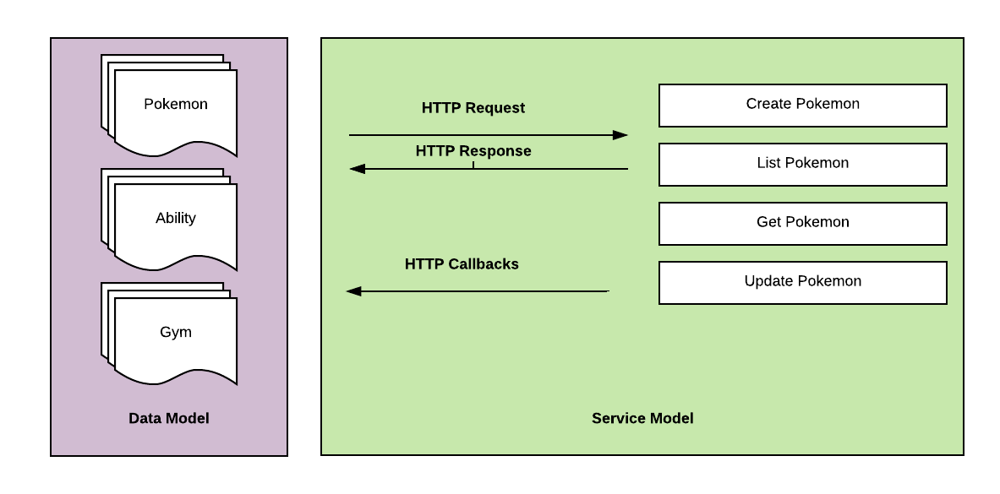

= API Contracts

The "I" in "API" means interface, and so writing a contract for that interface is the act of writing down what that interface is going to look like, to avoid folks having to guess, or go and hunt for some documentation somewhere.

Let's use the fantastic https://pokeapi.co/[PokeAPI] as an example.

[source,javascript]
----
{
  "id": 12,
  "name": "butterfree",
  "base_experience": 178,
  "height": 11,
  "is_default": true,
  "order": 16,
  "weight": 320,
  "abilities": [{
    "is_hidden": true,
    "slot": 3
  }]
}
----

If we look just at the data, we can deduce that sure, ID is probably an auto-incrementing identifier, the name seems to be a lower-cased English string, but after that it starts getting a bit odd.

Height and weight, I guess there is no imperial and metric in the game just units, but what is order all about? The order that pokemon is sat in my current party? That Ash bumped into in the cartoon? In order of cuteness? What?!

An API contract can help answer most of the questions and more for anyone wanting to understand how an API is meant to work.

- Which resources or methods are available and how do you interact with them?
- Which HTTP endpoints are required for that endpoint, for things like authentication?
- Which properties are available in the request and response?
- What are those various properties data types?
- Which of those properties are required or optional?
- What other validation rules can be applied to those properties?

[quote, The American Heritage Dictionary of the English Language]
____
A contract is an agreement between two or more parties, especially one that is written and enforceable by law.
____

Thinking about writing an API contract might sound a bit odd if you just think about an API as sharing some data or as a convenient way to trigger commands on another server, but people need to know what that data is, or what arguments they should send to those commands.

The enforceable bit is important too. We can use those contracts in our test suite to confirm that our actual APIs are following the rules of the contract.

NOTE: Some people use the term "API Specifications" to describe all this, but the word "specification" is used to mean a lot of different things. We just used it in the last chapter for something totally different, so let's stick to API Contracts to avoid confusion.

Written down exactly from an early point (and agreed upon) means that there are far fewer surprises throughout the API lifecycle, from planning, through development, and into usage by clients.

Having a good contract means that API developers can be confident that:

1. The interface is doing what they intend
2. The interface is going to be useful for client developers
3. The interface is understood well by client developers
4. The interface is not changing accidentally when code changes

This confidence will save everyone a lot of time, money and frustration. Having no contract in place leads to slower rollout of the initial version, loads more time spent testing subsequent deployments, and wasted developer time having loads of meetings to explain things that could have been written down and clear to everyone already.

== What forms can an API Contract take?

Some folks might think "That sounds like documentation", others might think "That sounds like tests". The answer is both, and more.

An API contract can exist in several forms, some more useful than others.

=== The Dreaded Verbal Contract

A common case is the verbal contract, where the API developers discuss it with the frontend or other client application developers as they go. The backend developers write their code, the client developers write theirs, and as various endpoints or properties are conceived, they are explained somehow: literally explained out loud over the conference room table, shouted over a hail of nerf gun pellets and ping pong, or DMed over Slack chats.

----
Fred: Hey Sarah, there’s a new "fudge" field and it can be "blah" or "whatever".

Sarah: Great! Thanks I’ll chuck that in now.
----

This works for a while. The API works, the app runs fine, we're making money, and we’re onto the next thing!

This method has a huge number, the main being that communication is hard. You never really know if somebody understood what you meant even if they say they did. Beyond that, not having things written down means people can forget. If another client team also needs the information and they ask another client team, they are getting a copy of a copy which might be slightly wrong.

Another outcome is the original author(s) cannot remember the exact rules, leading to time wasted checking the code. An even worse scenario is that the original author(s) are not reachable for some reason. Maybe the whole team of developers who worked on that API are all on a flight together from New York to Uruguay, and for that entire 9 hour flight nobody can get any answers about how the API is supposed to work, so they're stuck not being able to fix a production issue...

When folks rely on a verbal contract, two common things happen.

1. Developers waste time writing a new endpoint out of fear of using the old one
2. Developers waste time trying to guess the contract, and might guess wrong

=== Shoddy Human Contracts

When folks first start thinking about contracts, it often takes the form of rudimentary API Reference Documentation. This might be dumped into a Google Doc, shoved in a wiki, or written up in finger blistering HTML. These formats are usually fairly painstaking to create, because you are focusing on formatting _and_ content, shuffling things around whenever you remember that you should list headers too, and copying and pasting examples of JSON which might change over time. API developers would not settle for writing software like this, but apparently when it comes to documentation it's accepted as the norm.

This whole slow, manual approach is probably why many people forgo writing contracts this way, and opt for verbal contracts instead.It probably would not be a huge jump to say the "startup mindset" (and "agile") are one of a few potential driving factors in this "just get on with it" approach. There are many technical leaders inexperienced in this area telling their team "We'll write lovely docs later when we've got more time!" , without realizing their lack of clarity is slowing down initial development, client integrations, increasing testing efforts, and causing bizarre production issues and throughout their ecosystem.

Anyway, aside from this medium of API contracts being time consuming, it is also impossible to enforce. After you have spent the time writing up a Google Docs/HTML/Wiki, the only output of that is going to be... a Google Doc/HTML/Wiki and maybe a PDF if you want to go wild. You can't exactly jam that Google Doc into an API test suite and have it confirm that the API is conforming to whatever is written in there.

There is another way.

=== Description Languages

A description language can be text based or look a bit like a programming language. This format lets you describe an API in a reusable way, which means you can do a whole bunch of stuff:

- Documentation
- Client-side validation
- Server-side validation
- Client-library Generation (SDKs)
- UI Generation
- Server/Application generation
- Mock servers
- Contract testing

SOAP as been mentioned as one system that used to have meta-data which described its methods and messages using something called a WSDL:

[quote, Wikipedia]
----
The Web Services Description Language is an XML-based interface definition language that is used for describing the functionality offered by a web service. The acronym is also used for any specific WSDL description of a web service, which provides a machine-readable description of how the service can be called, what parameters it expects, and what data structures it returns. Therefore, its purpose is roughly similar to that of a type signature in a programming language.
----

WSDLs were only used for SOAP, and not many paradigms or implementations seemed to bother with this sort of description language for a long time. Luckily that has all changed over the last few years.

==== Endpoint-based APIs

In the endpoint-based API world there were a few such as https://apiblueprint.org/[API Blueprint], https://raml.org/[RAML], and Swagger, but for years the tooling was a bit lacking, and mostly only allowed for outputting as documentation. In 2018 one description language settled the mainstream favourite, and that was OpenAPI v3.0.

----
The OpenAPI Specification (OAS) defines a standard, programming language-agnostic interface description for REST APIs, which allows both humans and computers to discover and understand the capabilities of a service without requiring access to source code, additional documentation, or inspection of network traffic.
----

OpenAPI is slowly becoming the go-to description language for writing "endpoint-based API" contracts, and you will come to see why as it pops up in pretty much every part of this book. Planning, design, testing, management, you name it, OpenAPI can help out.

Another popular language is http://json-schema.org/[JSON Schema], which parts of OpenAPI are based on, and mostly compatible with.

.An overly simplified example of a basic API which lists collections and resources of hats.
[source,yaml]
----
openapi: 3.0.2
info:
  title: Cat on the Hat API
  version: 1.0.0
  description: The API for selling hats with pictures of cats.
servers:
  - url: "https://hats.example.com"
    description: Production server
  - url: "https://hats-staging.example.com"
    description: Staging server

paths:
  /hats:
    get:
      description: Returns all hats from the system that the user has access to
      responses:
        '200':
          description: A list of hats.
          content:
            application/json:
              schema:
                $ref: '#/components/schemas/hats'

components:
  schemas:
    hats:
      type: array
      items:
        $ref: "#/components/schemas/hat"

    hat:
      type: object
      properties:
        id:
          type: string
          format: uuid
        name:
          type: enum
          enum:
            - bowler
            - top
            - fedora
----

OpenAPI is a YAML or JSON based descriptive language which covers endpoints, headers, requests and responses, allows for examples in different mime types, outlines errors, and even lets developers write in potential values, validation rules, etc.

OpenAPI contract files are usually static. They're usually written down along with the source code, then sometimes deployed to a file hosting service like S3 for folks to use. Some managers want to treat these like business secrets and hide them under lock and key, which makes absolutely no damned sense as they are meta-data only. Most "hackers" could probably figure out that you keep your list of companies under `GET /companies`, so just don't make that a publicly available endpoint and you're gonna be ok. PayPal, Microsoft, and other companies make their OpenAPI contracts available to anyone who wants to download them, and this approach can help folks integrate with your APIs.

You can imagine an OpenAPI file growing to be rather unwieldy once its got 50+ endpoints and more complex examples, but have no fear you can spread things around in multiple files to make it a lot more DRY (Don't Repeat Yourself) and useful. The first thing to go is usually the `components.schema` definitions, which can be moved to their own files. These files are essentially JSON Schema, so you can have the best of both worlds using both OpenAPI and JSON Schema for various things.

It's quite common to then also make the JSON Schema files available over the wire, by putting links to the static .json files in an HTTP response header. This can provide more information about the object to the API client without needing to figure out how to distribute the files to them ahead of time.

==== GraphQL

GraphQL as an implementation comes bundled with its own type system, which acts as its source of truth for API contracts: GraphQL Schemas.

All the GraphQL documentation examples are Star Wars. Sure, it's obviously inferior to Stargate SG-1, but let's reuse their examples for simplicity:

.An example of GraphQL schemas implementing interfaces and sharing properties across different types.
[source,graphql]
----
interface Character {
  id: ID!
  name: String!
  friends: [Character]
  appearsIn: [Episode]!
}

type Human implements Character {
  id: ID!
  name: String!
  friends: [Character]
  appearsIn: [Episode]!
  starships: [Starship]
  totalCredits: Int
}

type Droid implements Character {
  id: ID!
  name: String!
  friends: [Character]
  appearsIn: [Episode]!
  primaryFunction: String
}
----

These schemas can be defined in whatever programming language the API is built in: JavaScript, PHP, Go, whatever, but they are usually not written in one definitive format. That makes portability a little funky (you couldn't give a Go defined schema to a JavaScript client), but not impossible.

GraphQL schema does not support validation being defined in the contract like OpenAPI and JSON Schema, but there are some extensions floating around which can help. More on all of that later.

==== gRPC

gRPC uses another Google tool for its API contract: https://developers.google.com/protocol-buffers/[Protobuf]. Protobuf is basically a serializer for data going over the wire. Much like GraphQL and its schemas, Protobuf is integral to gRPC. Instead of schemas they call them "Message Types", but it's all the same sort of idea.

Instead of writing them in whatever language the API is written in (like GraphQL), a new  `.proto` file is written using https://developers.google.com/protocol-buffers/docs/proto[Protocol Buffer Language Syntax]. This C-family/Java style language exists solely for writing these files. It might be a bit of a pain to figure out a brand new syntax, ut it has the benefit of being fairly portable as you can read them in multiple languages. Finding a JavaScript, Ruby, Python, Go, etc. tool that can read a `.proto` file is a whole lot easier than trying to get Python to read something written in  - for example - JavaScript.

Rarely are `.proto` files made available over a URL, they are usually bundled and distributed with client code. Then usually things are kept backwards compatible until the clients have upgraded whatever client code brought the `.proto` files their way.

== Service Model & Data Model

Two terms that pop up from time to time are "service model" and "data model". These are two ways to specify which part of the API contract you are talking about.

The service model is the language used to describe things like the URL, HTTP method, headers like content type, authentication strategy, etc. It is used to explain all the things outside of the actual content of the message, the peripheral stuff to the actual data.

In the previous OpenAPI example, this would be the service model:

[source,yaml]
----
paths:
  /hats:
    get:
      description: Returns all hats from the system that the user has access to
      responses:
        '200':
          description: A list of hats.
          content:
            application/json:
              schema:
                $ref: '#/components/schemas/hats'
----

The data model is used to describe the contents of the message, which is probably what you find in the HTTP body. The word "schema" is often associated with the data model.

Continuing on from the above example, the following lines would be added to include the data model defined in another file:

.An example of a data model, showing which properties are likely to be found.
[source,yaml]
----
type: object
properties:
  id:
    type: string
    format: uuid
  name:
    type: enum
    enum:
      - bowler
      - top
      - fedora
----

GraphQL does not really have a service model, as it does not need one. All interactions operate under a single HTTP endpoint - usually `POST /graphql` - so there is no real need to bother writing a contract around that in great detail. It would just be mentioned in passing as an implementation detail, and the majority of the effort would go into describing the data model.

gRPC sort of has a service model. It is just a web server you hit with methods and arguments. So there might not be different endpoints,footnote:[Without getting the gRPC JSON Gateway involved: https://github.com/grpc-ecosystem/grpc-gateway] but the different method names are essentially the service model.

== Summary

The terms "API Contract" and "API Specifications" often mean the same thing depending on the context, but the term specification is used to describe a lot of other things in this space too. If you are talking about planning, building, or documenting an API and somebody mentions "API specifications", then they are talking about this stuff.

The terms "schema", and "data model", are usually closely related. In the terms of an HTTP API, the data model describes the body of the HTTP message, and that description is often referred to as a schema.

Ask a bunch of different people and you will get a lot of difference answers, but these terms will be used throughout the book just so there is one standard way of talking.

Writing down contracts might seem like a lot of work, but should no longer be considered as an optional step by API developers. It's reckless, selfish, and actually makes work considerably more mundane. API contracts are not just for creating documentation. Writing them will increase productivity throughout the life-cycle of the API (and its clients), and give you reference documentation for free when it is needed.

Later chapters will cover exactly how contracts can get involved at various points. This introduction will most likely have left you with questions, and they will be answered throughout the rest of the book.