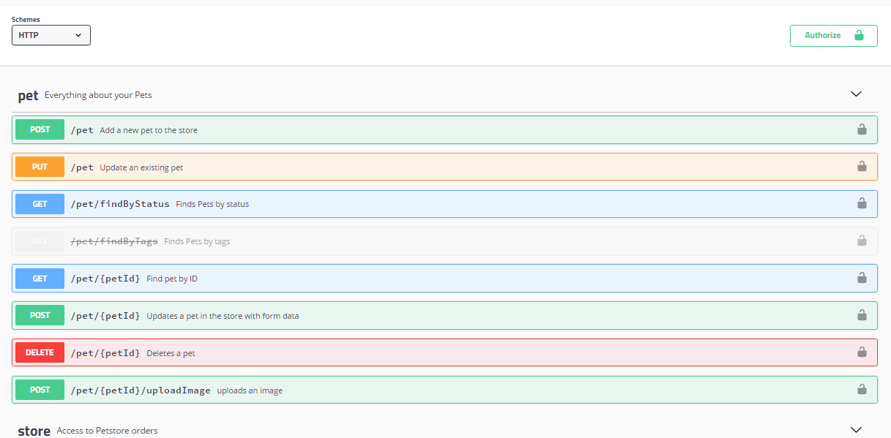
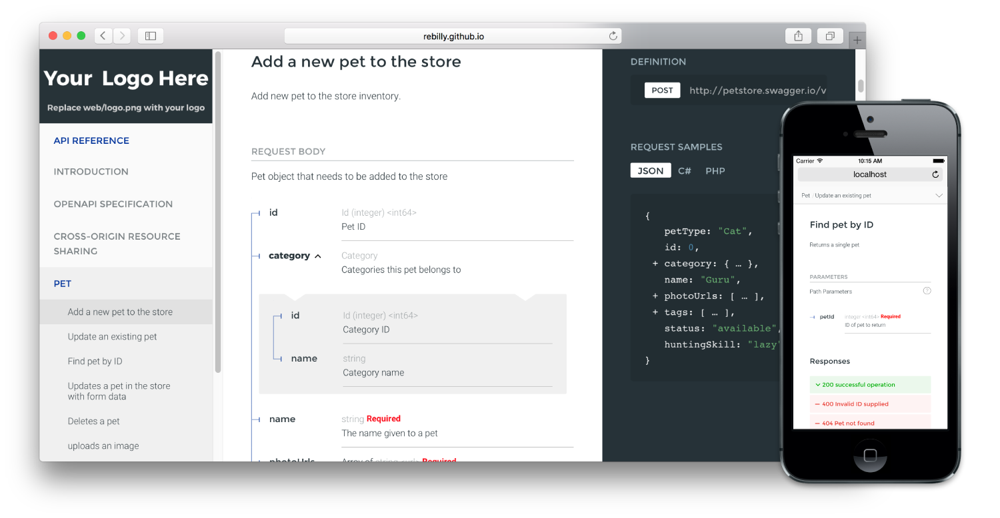
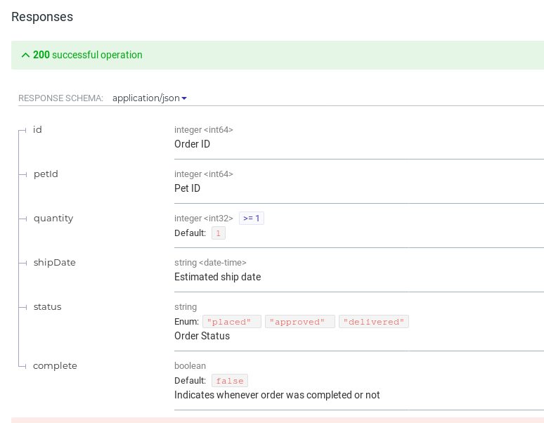

= Documentation

Throughout the planning phase, all the API developers involved, other folks on your team, and potential clients are going to want to see how this API is going to work. Thankfully you have chosen to write down how it all works with contracts, so this will be easy.

All we need to do is turn those contract files (probably `.json`, `.yaml`, `.proto`, .etc) into some human-readable documentation for them to point their faces at. Usually HTML to be thrown on a web server, or questionably PDF files for emailing around.

== Endpoint-based APIs

=== OpenAPI

OpenAPI has some amazing tools, and a really ugly one: https://swagger.io/swagger-ui/[Swagger UI].

=== Swagger UI

This tool is hard to recommend for a bunch of reasons, first and foremost is its appearance.

.A screenshot of Swagger UI, which looks like it was designed by not just a developer, but one who was a big fan of RPC.

Swagger UI used to be the only option, and it was a major contributor to me completely ignoring Swagger for years. It not only looks pretty rough, but it hides the data model under a few unclear options, meaning the most important data can hardly be seen.

For REST APIs this can cause a problem; Documenting an API as purely HTTP requests with the actual objects being hidden away as an afterthought leads to them being used like an RPC API, even when they have hypermedia controls available.

I would recommend you skip this one, and give ReDoc a try.

=== ReDoc

By far my favourite of the lot, ReDoc just looks absolutely stunning. You can add a logo with the `x-logo` vendor extension, tweak colors, and you get that awesome three-column style popularized by docs like the https://stripe.com/docs/api[Stripe API Documentation].

.Fancy/modern looking three-col API documentation using ReDoc.

Beyond the looks, ReDoc focuses a lot of elevating the data model (a.k.a schema) to the documentation viewer. It outlines data types, possible enum values, and all sorts of other handy stuff.

.Down arrows let you expand nested objects to avoid initial clutter.

ReDoc can be used as a React command or embedded in HTML, but the most common approach to use it is via the command line. Look at their documentation for instructions, but one way is to install as a node module.

[source]
----
npm install -g redoc-cli
----

To see how the documentation looks locally, you can run a local web server using the ReDoc CLI tool.

[source]
----
$ redoc-cli serve openapi.yaml --watch
TODO update example when ubuntu NodeJS stops cocking about
----

This will run a local HTTP server, and you can load up in your local browser. The `--watch` switch means changes to the local files will be automatically detected, and should show up when you refresh the browser.

When somebody else asks for a look, you can then do a few things, but a common thing to do is ask the documentation generator to create HTML for sharing around.

[source]
----
$ redoc-cli bundle openapi.yaml
----

This will create a single HTML file with embedded CSS and JavaScript, which means there are no dependencies other than the one file it creates. You can chuck this up on Amazon S3 or wherever you like to host your static files, then people can take a look and give you feedback.

== GraphQL

https://github.com/graphql/graphiql
An in-browser IDE for exploring GraphQL.

== gRPC

https://github.com/pseudomuto/protoc-gen-doc
[protoc-gen-doc] is a documentation generator plugin for the Google Protocol Buffers compiler (protoc). The plugin can generate HTML, JSON, DocBook and Markdown documentation from comments in your .proto files.
