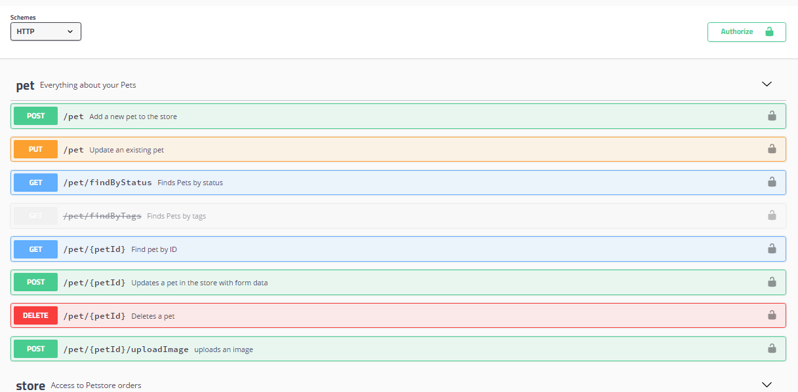
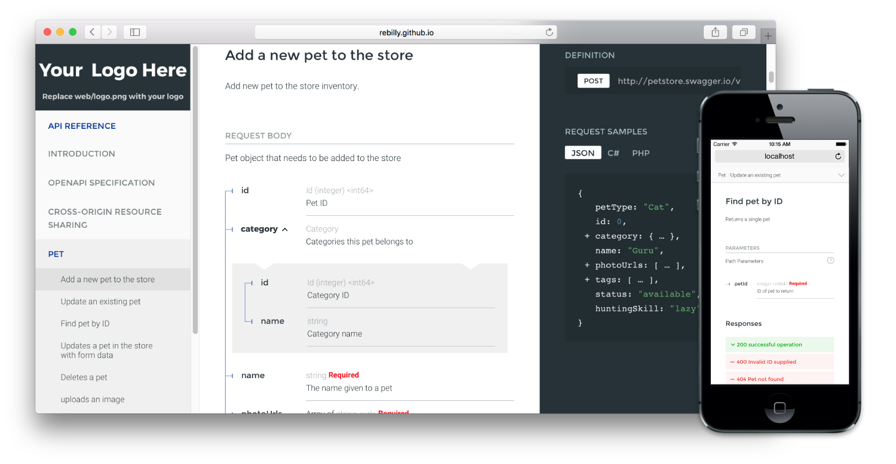
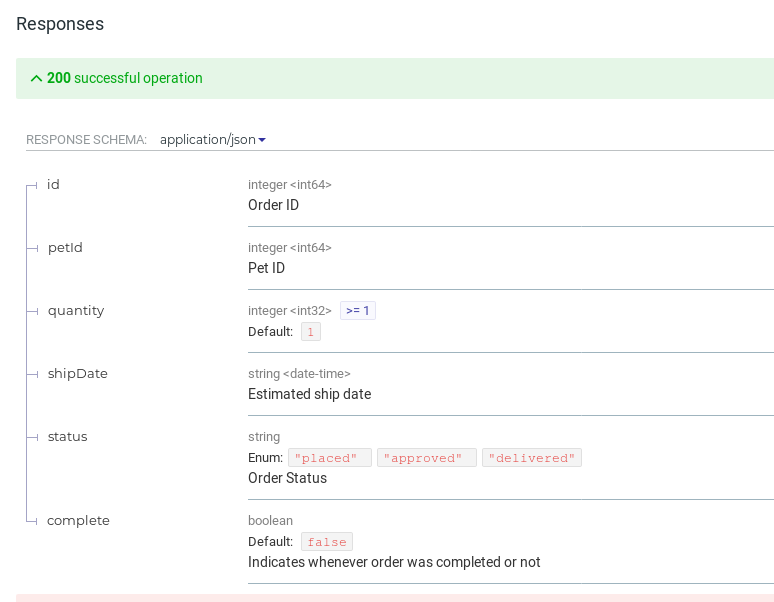

= Reference Documentation

So, you handed out the mock server to the various API client teams, and thought
they would get straight to work trying to integrate it. Sadly your inbox is now
rammed full of questions from those client developers asking how the heck they
use the API.

*REST devs:* You don't need reference docs, the message is self documenting
through the rules of HTTP and HATEOAS explains interactions!

*GraphQL devs:* You don't need reference docs, you have GraphiQL!

*gRPC devs:* You don't need reference docs, you have .proto files!

Guess what? If you want that sweet-sweet feedback, you'll need to help your
clients implement the API, and the best way to avoid inboxmageddon is to
distribute "API Reference Documentation".

This is usually an overview of methods/resources available in your API, and looks a lot like the sort
of documentation you'd expect to see for a class or function in any programming
language. These should always be accompanied by guides and tutorials at a later
stage, but early on you will want to provide at least the reference
documentation to folks.

Thankfully you have chosen to write down how it all works with contracts, so
this will be easy. All we need to do is turn those contract files (probably
`.json`, `.yaml`, `.proto`, .etc) into some human-readable documentation for
them to point their faces at. Usually HTML to be thrown on a web server, or
questionably PDF files for emailing around.

== OpenAPI

OpenAPI has quite a few options for creating reference documentation from source files.

=== Swagger UI

This tool is hard to recommend due to it's very dated appearance.

.A screenshot of Swagger UI, which looks like it was designed by not just a developer, but one who was a big fan of RPC.

Swagger UI used to be the only option, and it was a major contributor to me
completely ignoring Swagger for years. It not only looks pretty rough, but it
hides the data model under a few unclear options, meaning the most important
data can hardly be seen.

That said, it has an "API console" built in. More on those later.

=== ReDoc

By far my favourite of the lot, https://github.com/Rebilly/ReDoc[ReDoc] looks
absolutely stunning. You can add a logo with the `x-logo` vendor extension,
tweak colors, and you get that awesome three-column style popularized by docs
like the https://stripe.com/docs/api[Stripe API Documentation].

.Fancy/modern looking three-col API documentation using ReDoc.

Beyond the looks, ReDoc focuses a lot of elevating the data model (a.k.a schema)
to the documentation viewer. It outlines data types, possible enum values, and
all sorts of other handy stuff.

.Down arrows let you expand nested objects to avoid initial clutter.

ReDoc can be used as a React command or embedded in HTML, but the most common approach to use it is via the command line. Look at their documentation for instructions, but one way is to install as a node module.

[source]
----
$ npm install -g redoc-cli
----

To see how the documentation looks locally, you can run a local web server using the ReDoc CLI tool.

[source]
----
$ redoc-cli serve openapi.yaml --watch
TODO update example when ubuntu NodeJS stops cocking about
----

This will run a local HTTP server, and you can load up in your local browser.
The `--watch` switch means changes to the local files will be automatically
detected, and should show up when you refresh the browser.

When somebody else asks for a look, you can ask the documentation generator to
create HTML for sharing around.

[source]
----
$ redoc-cli bundle openapi.yaml
----

This will create a single HTML file with embedded CSS and JavaScript, which
means there are no dependencies other than the one file it creates. You can
chuck this up on Amazon S3 or wherever you like to host your static files, then
people can take a look and give you feedback.

ReDoc will also have an API console at some point, but it is not complete at
time of writing. This will turn a reference documentation tool into a fully
fledged, API client, letting your users trial interactions from the browser.

== GraphQL

During the early stages of GraphQL planning and development, you don't really
need to create reference documentation in the classic sense. There is an
official tool which is essentially an API console with documentation build in.

This tool is https://github.com/graphql/graphiql[GraphiQL], and it is basically
an IDE which can run in various environments.

Although you are in the planning stage and might not be sure what language you
are going to build this thing in, if you are a big fan of NodeJS and are likely
to use ExpressJS, then you are in luck:
https://github.com/graphql/express-graphql[express-graphql] has Graphiql built
in. There are some other installation instructions on the
https://github.com/graphql/graphiql[repository README].

There are also a bunch of Chrome extensions floating around which you can use
instead of running a local instance of GraphiQL, one of which is called
https://chrome.google.com/webstore/detail/chromeiql/fkkiamalmpiidkljmicmjfbieiclmeij[ChromeiQL].

Using these tools you can interact with your fake API, and when you start to
develop the real one you can interact with that too.

== gRPC

https://github.com/pseudomuto/protoc-gen-doc [protoc-gen-doc] is a documentation
generator plugin for the Google Protocol Buffers compiler (protoc). The plugin
can generate HTML, JSON, DocBook and Markdown documentation from comments in
your `.proto` files.
