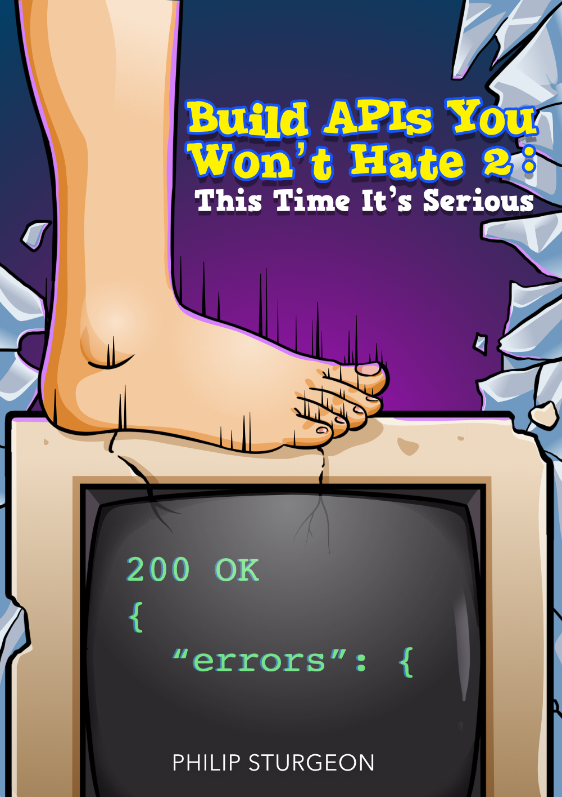

= Build APIs You Won't Hate
Philip Sturgeon <phil@apisyouwonthate.com>
:doctype: book
:creator: Philip Sturgeon
:front-cover-image: 
:keywords: API, architecture, REST, gRPC, RPC, HTTP, GraphQL, microservices, API Design
:source-highlighter: coderay
:toc:

include::0-stuff/author.adoc[]

include::0-stuff/introduction.adoc[]

:leveloffset: +1

:sectnums:

[part]
= Part One: Theory
:imagesdir: 1-theory

include::1-theory/1-apis-services-microservices.adoc[]

include::1-theory/2-different-paradigms.adoc[]

include::1-theory/3-api-contracts.adoc[]

[part]
= Part Two: Planning & Design

:imagesdir: 2-planning

include::2-planning/0-introduction.adoc[]

include::2-planning/1-editors.adoc[]

include::2-planning/2-mocking.adoc[]

include::2-planning/3-documentation.adoc[]

[part]
= Part Three: Testing & Monitoring

[part]
= Part Four: Management

[part]
= Part Five: Further Theory
