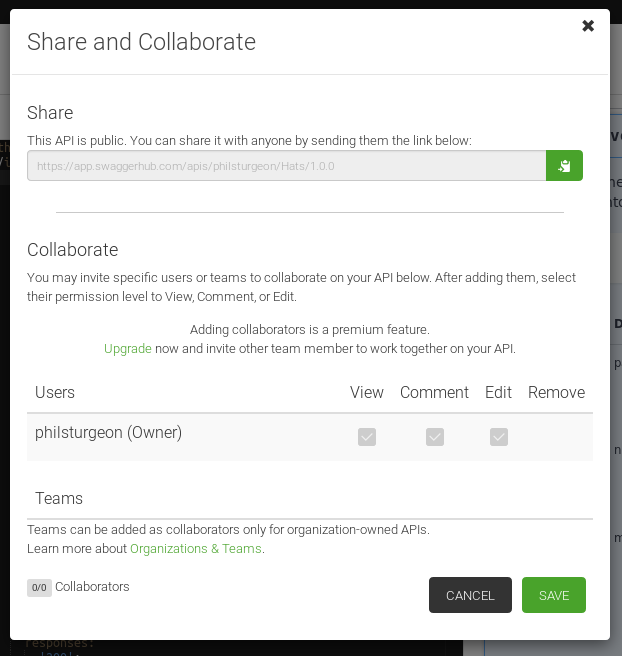
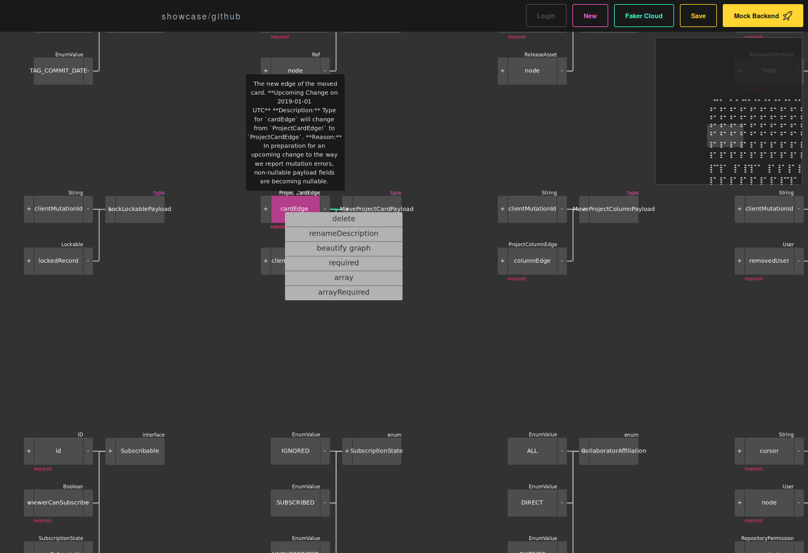

= Editors

Editors exist in various forms for various API description formats, and they
can drastically ease the creation of descriptions when starting from scratch. These
can take a few forms.

== Text or GUI

Some editors are GUI-based (Graphical User Interface) and let you design things
with clicking buttons and working with forms.

Others are text-based and provide you with a real-time preview panel whilst you
type, making it slightly easier than working with plain-old YAML/JSON.

== Prototyping, Walled Gardens, & Local File Editors

Beyond the "text-based" or "GUI" distinction, there are other characteristics
which will effect where the descriptions live and how you interact with them.

Some editors are intended for rapid prototyping only, helping you to create an
initial design and then push you to export the descriptions as text to
copy-and-paste, or download as files. From that point on, you're on your own,
and have to find some other way to keep your description documents up-to-date.

Others are hosted solutions which keep a hold of your description documents, and
offer limited options for syncing to whatever pre-determined locations they
chose to support. Maybe something specific like GitLab, or generic git
repository, or they publish them to a URL accessible over HTTP, or something
else.

Other editors can take the form of desktop applications, which can be used
throughout the life-cycle, loading local files and allowing you to edit them and
commit them back to the repository (or wherever they live) at will.

== Standard HTTP Editors

=== Swagger Editor

https://editor.swagger.io/[Swagger Editor] is a very simple text-based editor from
https://smartbear.com/[SmartBear]. You can find it hosted on swagger.com, and it
can be downloaded and run locally for free.

NOTE: Remember, SmartBear call their suite of tools "Swagger" because they own
the copyright and they don't feel like re-branding, but the description format
is officially called OpenAPI, not Swagger. Nobody else should be using the word
Swagger, or calling their tooling Swagger, or anything else.

image::images/editors-swagger-editor.png[]

Mostly it is just a text-editor, with the left panel being a YAML/JSON editor,
and the right panel is https://swagger.io/tools/swagger-ui/[Swagger UI], the
documentation tool from SmartBear.

It can be nice to write specifications on the left and see their rendering as
documentation on the right, but it would possibly be more useful if the right
contained forms for managing the specification beyond modifying text, but the
right panel is purely read-only. There are a few forms for adding new
operations, tags, servers, etc. but they do not cover everything.

image::images/editors-swagger-editor-form.png[]

This simple editor helps in a few cases, like:

- You have never written any OpenAPI and want to try playing around with real-time feedback
- You are getting validation errors from some local tool which seem weird, so you bundle the multiple files into one file and paste it up here to see what it says

There is not much else you will want to use Swagger Editor for. If you are
splitting files up using `$ref` (which you pretty much always want to do), then
this will not work as it only supports the one text box.

For ongoing editing and multi-file support you will need something a bit more powerful.

=== SwaggerHub

https://swagger.io/tools/swaggerhub/[SwaggerHub] is another tool from Smartbear, and it is basically the hosted version of Swagger Editor which has some integrations with the rest of the Swagger tool-suite.

.In this demo of SwaggerHub you can see Swagger Editor in full swing, with a few other options floating around the outside.
image::images/editors-swaggerhub-demo.png[]

SwaggerHub includes a mock server, as most of these editors do. It will help you
converting from OpenAPI v2.0 to v3.0 which is a nice touch. The integration with
Swagger Inspector - a lovely tool which can help build OpenAPI specifications
off of HTTP interactions... more on that later.

The collaboration options here are pretty handy. You can invite users or teams
to collaborate on an API, and they have a permissions system which seems pretty
closely modelled on Google Docs.

.Get collaborating with other folks without having to email YAML files around!

If working with multiple files is possible in SwaggerHub, I have certainly never
figured it out. For this reason I have steered clear, but for teams just
starting out it might be worth playing with.

The pricing is user-based, and does not seem to support "monthly active users"
like slack. Many companies only have 1 or 2 folks who care about API descriptions
(which is sad and slowly improving over time) but at a company with ~100
engineers (and a better culture), this could get rather expensive. Trying to
convince your boss that a YAML text-editor with collaboration might be a tough
sell, especially when there are more powerful alternatives, or free open-source
offerings.

=== Stoplight

http://stoplight.io/[Stoplight] is a GUI editor, with forms and a much more
"Wizard"-like approach. You can ignore the YAML representation entirely and work
with their forms and model editors.

Right now they only support OpenAPI v2.0 via the GUI but the text mode supports
OpenAPI v3.0. They have all sorts of amazing features. Stoplight has the usual
collaboration and mocking, and other features like linting based on style
guides, the ability to share models throughout the organization (to avoid having
20 different "user" or "location" representations) and has desktop applications
for Windows, Mac and Linux.

I started working for Stoplight right around the time I started writing this
second book, so to avoid complex bias I will share some words from Kin "API
Evangelist" Lane:

[quote,Kin Lane,API Evangelist]
____
I feel like Stoplight has the potential to shift the landscape pretty significantly, something I haven't seen any API service provider do in a while.
____

More to come on this one. They will most likely have a new suite of tools out
before this book goes to the printer.

// TODO Review the fancy new editor

Stoplight costs more than SwaggerHub, but is likely to be an easier sell due to
the fact it does a whole lot more. Non-technical users can get in there to play
around, and it adds a lot more value beyond being a YAML/JSON text-editor.

=== Free/Open-Source Tools

Bootstrapping a project and have no budget for fancy tooling? Not a problem.

Check out https://openapi.tools[OpenAPI.tools] for an up-to-date list, but there
are a few GUI editors, and a few plugins for popular software like
https://code.visualstudio.com/[Visual Studio Code], https://atom.io/[Atom], etc.
which can ease the struggle of writing the files by hand.

- VS Code: https://marketplace.visualstudio.com/items?itemName=mermade.openapi-lint[openapi-lint]
- Atom: https://atom.io/packages/linter-swagger[linter-swagger]
- Jetbrains IDE: https://senya.io/[Senya]

Then there is https://apibldr.com/[ApiBldr], a free hosted GUI editor which can
help build and then download descriptions.

== GraphQL Editors

https://graphqleditor.com/[GraphQL Editor] is a GUI editor, with text on the
left where you define various types, and a visual representation of everything
as nodes on the right. You can click on those nodes, modify properties, and set
criteria like required, null, etc.

It can be installed locally via npm, then invoked as a React component.

If you don't know what any of those things mean then fair enough, there is a
hosted version: https://app.graphqleditor.com/[GraphQL Editor Cloud].

.A screenshot of https://app.graphqleditor.com/showcase/github[the "Github example" on graphqleditor.com]

As with many editors it comes with an option to provide a mock server for the
schemas you've just written up. The hosted version also has the ability to save
projects.

== Protobuf Editors

The Protobuf syntax is incredibly simple, and there is not much going on in the
way of functionality or logic in these files. Maybe this is why there are not
many GUI editors around, as you just don't need them.
https://sourceforge.net/projects/protobufeditor/[Protobuf Editor] is one I found
lurking on SourceForge.

There are plenty of plugins ready to add syntax highlighting, linting,
auto-complete, etc. to your IDE or code editor of choice.

- VS Code: https://marketplace.visualstudio.com/items?itemName=zxh404.vscode-proto3[vscode-proto3]
- Atom: https://atom.io/packages/language-protobuf[language-protobuf]
- Jetbrains IDE: https://plugins.jetbrains.com/plugin/8277-protobuf-support[Protbuf Support]

== Maybe You Don't Use an Editor

This can be a personal choice. Some folks love having their descriptions live up in
the cloud so they can be easily collaborated on, some want to keep them in the
repository so they can discuss things in GitHub pull-requests for their
collaboration, and as such want editors which can work with local files.

Whatever you do, when you start out I recommend using an editor to get the ball
rolling. Then later on if you want to tweak things by hand, that's probably ok.
It will be a while before you work out your exact workflow for descriptions (if
nobody has worked that out for you), so it can make sense to just get stuck in
with whatever hosted editor, then you can probably export things later and
cancel your account if you hate it.

== Next

Either way, if you are currently working on an API now, put this book down for a
little bit, and get to work on creating some API descriptions. It could be
nonsense, or it could be a real project, but the next chapter will start by
assuming you have written up a bunch of API descriptions.

Consult the documentation, tutorials, videos, etc. for the specific API
description format in question if there is any confusion that comes up.
Hopefully the editors will have your back, but if they don't, there is always
Google.

== TODO Merge this in

One thing that SwaggerHub does well is providing an OpenAPI editing experience. Users write YAML/JSON in an editor window on the left, and see a preview of that OpenAPI as documentation on the right. This gives new users of OpenAPI more confidence, because they can see their changes as they work on it.

Using open-source tooling can provide this exact same experience, easier, cheaper, and more powerful, without needing to pay for a hosted service. Whatever your favorite IDE or text-editor, there's an OpenAPI extension you can use to bring in that preview experience on your development machine.

=== VS Code OpenAPI Extension

https://code.visualstudio.com/[VS Code] users have a variety of popular extensions to chose from.

* https://marketplace.visualstudio.com/items?itemName=42Crunch.vscode-openapi[OpenAPI Editor] by 42Crunch - code navigation, linting, SwaggerUI or ReDoc preview, IntelliSense, schema enforcement and generation, schema definition links, snippets as well as static and dynamic security analysis.
* https://marketplace.visualstudio.com/items?itemName=zoellner.openapi-preview[OpenAPI Preview] by Andreas Zoellner - Preview panel using Stoplight Elements.
* https://marketplace.visualstudio.com/items?itemName=AndrewButson.vscode-openapi-viewer[OpenAPI Viewer] by Andrew Butson - Preview panel using RapiDoc.

The OpenAPI Editor from 42 Crunch is a powerful choice, offering not just a preview panel but auto-complete and a "explorer" view to help you move around the OpenAPI document. It also has a choice of preview tools, with Swagger UI being the exact same tool used on SwaggerHub.

image::/images/guides/migrating-from-swaggerhub/42crunch-openapi-editor.png[]

The other tools offer just a preview experience, but offer two alternative open-source OpenAPI rendering tools to give you a few options in how you look at the OpenAPI as you go.

=== JetBrains IntelliJ

The JetBrains team clearly recognize the importance of OpenAPI to their IntelliJ, PhpStorm, RubyMine, etc. community because they've created an official extension: https://plugins.jetbrains.com/plugin/14394-openapi-specifications[Jetbrains OpenAPI Specifications].

image::/images/guides/migrating-from-swaggerhub/jetbrains-openapi-specifications.png[]

The 42Crunch team have also built an extension: https://plugins.jetbrains.com/plugin/14837-openapi-swagger-editor[OpenAPI​ Editor] will provide IntelliSense, "Go to Definition" for `$ref`, and the usual preview showing SwaggerUI or ReDoc.

=== Other Editors

Check on https://openapi.tools/[OpenAPI.Tools] to find more editors with OpenAPI preview functionality like Eclipse and Vim.

If there are no OpenAPI preview tools for your editor of choice, you can open up a browser window and use the https://github.com/bump-sh/cli[Bump.sh CLI]'s `preview --live` command to see how changes look as you work on your document.

[,console]
----
$ bump preview openapi.yaml --live

* Let's render a preview on Bump... done
* Your preview is visible at: https://bump.sh/preview/4a478f7d-8776-4c43-bc01-cf58dd7dd5f5 (Expires at 2024-05-29T16:17:06+02:00)
Waiting for changes on file openapi.yaml......
----
