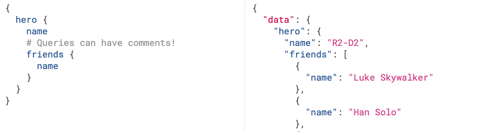

[#theory-paradigms]
= Understanding Different Paradigms

If APIs are the interface for some sort of service, it should not come as a surprise that not all the interfaces in the world are going to have the same needs and requirements. Most of them are a case of "execute a command", "interact with data", or a combination of both.

There are three distinct types of Web API which handles these common needs, and these different types are known as paradigms. To oversimplify things a bit, it’s reasonably fair to say that all APIs conform to one of these paradigms:

- RPC (Remote Procedure Call)
- REST (Representational State Transfer)
- Query Languages

These paradigms are general approaches to building APIs, not a specific tool or specification. They are merely an idea or set of ideas, not a tangible thing. For that, we need to look at implementations.

*Implementations* are something you can actually download, install, and use to build an API, that conforms to whatever rules the implementors picked, from whichever paradigm (or paradigms) they were interested in at the time.

*Specifications* (or standards, recommendations, etc.) are often drafted up by various working groups, to help implementations share functionality in the same way. An API and a client in different languages can work together perfectly if they’re all following the specification correctly. The difference between a standard and a specification is usually just down to who made it. When a working group like the IETF or W3C create something, it's a standard, but when Google knock something out on their own, it's a specification.

For example:

- SOAP is a W3C recommendation, following the RPC paradigm, with implementations like gSOAP
- gRPC is an implementation, following the RPC paradigm, which has no standard defined by any working group, but authors Google Inc. did document the protocol in a specification
- REST is a paradigm, which has never been turned into a specification, and has no official implementations, but building a REST API is usually just a case of picking appropriate standards and tooling

Making direct comparisons between any of these things is tough because it should be possible to see that paradigms, implementations and specifications are all rather different. We'll be covering all the paradigms, and we will be looking at how things work in a few of the more popular implementations throughout the book.

First, let us try and figure out the main conceptual differences between the paradigms.

== Remote Procedure Call (RPC)

RPC is the earliest, simplest form of API interaction. It is about executing a block of code on another server, and when implemented in HyperText Transfer Protocol (HTTP) or Advanced Message Queuing Protocol (AMQP) it can become a Web API. There is a method and some arguments, and that is pretty much it. Think of it like calling a function in JavaScript, taking a method name and arguments.

For example:

----
POST /sayHello HTTP/1.1
HOST: api.example.com
Content-Type: application/json

{"name": "Racey McRacerson"}
----

In JavaScript, the equivalent concept is defining a function, and calling it elsewhere:

[source,javascript]
----
/* Signature */
function sayHello(name) {
  // ...
}

/* Usage */
sayHello("Racey McRacerson");
----

The idea is the same. An API is built by defining public methods; then, the methods are called with arguments. RPC is just a bunch of functions, but in the context of an HTTP API, that entails putting the method in the URL and the arguments in the query string or body.

When used for CRUD ("Create, Read, Update, Delete"), RPC is just a case of sending up and down data fields. This can be fine, but it also means the client is in charge of pretty much everything. The client must know which methods to hit, and at what time, in order to construct its own workflow out of a bevy of methods, with only human interaction or written interactions to help the client application developer figure out what to do and in which order. That might be a positive, or a negative, depending on what sort of relationship you want your clients and servers to have.

RPC is without doubt the most prominent paradigm used in API land, possibly because it feels so natural to many programmers. Calling a function locally and calling a function remotely feel so similar, that it just clicks with a lot of developers.

That said, there are a few other things to figure out, like should the method name go in the URL, or should it be passed in the body. Should it be entirely POST or a combination of GET and POST? Should we use metadata to describe what the payload data is? To answer questions like this, RPC has a whole bunch of specifications, all of which have concrete implementations:

.Older popular RPC standards
- XML-RPC
- JSON-RPC
- SOAP (Simple Object Access Protocol)

XML-RPC and JSON-RPC are not used all that much other than by a minority of entrenched fanatics, but SOAP is still kicking around for a lot of financial services and corporate systems like Salesforce.

XML-RPC was problematic, because ensuring data types of XML payloads is tough. In XML, a lot of things are just strings, which JSON does improve, but has trouble differentiating different data formats like integers and decimals.

You need to layer metadata on top in order to describe things such as which fields correspond to which data types. This became part of the basis for SOAP, which used XML Schema and a WSDL (Web Services Description Language) to explain what went where and what it contained.

This metadata is essentially what most science teachers drill into you from a young age: "label your units!". The sort of thing that stops people paying $100 for something that should have been $1 but was just marked as `price: 100` which was meant to be cents...

All three of these specifications had implementations created by various people, mostly as open-source projects. Occasionally the folks who put the standard together created an official implementation in their favourite language, and the community built their own in other languages they wanted to use.

A modern RPC specification is gRPC, which can easily be considered modern SOAP. It uses a data format called Protobuf, which requires a schema file as well as the data instance, much like the WSDL in SOAP. This Protobuf file is shared with both the client and the server, and then messages can be verified and passed between the server and client in binary, which leads to smaller messages than passing around big chunks of JSON.

gRPC focuses on making single RPC interactions, and it aims to achieve this as quickly as possible, thanks to the aforementioned binary benefits, and its other huge benefit: HTTP/2. All of the gRPC implementations are HTTP/2 by default, and usually handle this with their own built-in web server to make sure HTTP/2 works the whole way through the transaction.

== Representational State Transfer (REST)

REST is a network paradigm, published by Roy Fielding in a dissertation in 2000. REST is all about a client-server relationship, where server-side data are made available through representations of data in simple formats. This format is usually JSON or XML but could be anything (including Protobuf).

These representations portray data from various sources as simple "resources", or "collections" of resources, which are then potentially modifiable with actions and relationships being made discoverable via a concept known as HATEOAS (Hypermedia as the Engine of Application State). That's a rough acronym that confuses folks, so many API people just use the term "Hypermedia Controls" to mean the same thing.

Hypermedia controls are fundamental to REST. It is merely the concept of providing "next available actions", which could be related data, or more often it's actions available for that resource in its current state, like having a "pay" option for an invoice that has not yet been paid.

These actions are just links, but the idea is the client knows that an invoice is payable by the presence of a "pay" link, and if that link is not there it should not show that option to the end user.

[source,javascript]
----
{
  "data": {
    "type": "invoice",
    "id": "093b941d",
    "attributes": {
      "created_at": "2017–06–15 12:31:01Z",
      "sent_at": "2017–06–15 12:34:29Z",
      "paid_at": null,
      "status": "published"
    }
  },
  "links": {
    "pay": "https://api.acme.com/invoices/093b941d/payment_attempts"
  }
}
----

This is quite different to RPC. Imagine the two approaches were humans answering the phones for a doctors office:

*Client:* Hi, I would like to speak to Dr Watson, is he there?

*RPC:* No. *click*

_Client calls back_

*Client:* I found his calendar and luckily I know how to interact with the Google Calander API. I have checked his availability, and it looks like he is off for the day. I would like to visit another doctor, and it looks like Dr Jones is available at 3pm, can I see her then?

*RPC:* Yes.

The burden of knowing what to do is entirely on the client, and this can lead to "fat clients" (i.e: the client contains a lot of business logic). It needs to know all the data, come to the appropriate conclusion itself, then has to figure out what to do next.

REST, however, presents you with the next available options:

*Client:* Hi, I would like to speak to Dr Watson, is he there?

*REST:* Doctor Watson is not currently in the office, he’ll be back tomorrow, but you have a few options. If it’s not urgent you could leave a message and I’ll get it to him tomorrow, or I can book you with another doctor, would you like to hear who is available today?

*Client:* Yes, please let me know who is there!

*REST:* Doctors Smith and Jones, here are links to their profiles.

*Client:* Ok, Doctor Jones looks like my sort of Doctor, I would like to see them, let’s make that appointment.

*REST:* Appointment created, here’s a link to the appointment details.

REST provided all of the relevant information with the response, and the client was able to pick through the options to resolve the situation.

None of this is magic, no client is going to know exactly what to do without being trained, but the client of a REST API can be told to follow the `"alternative_doctors": "https://api.example.com/available_doctors?available_at=2017-01-01 03:00:00 GMT"`` link. That is far less of a burden on the client than expecting it to check the calendar itself, seek for availability, etc.

This centralization of state into the server has benefits for systems with multiple different clients who offer similar workflows. Instead of distributing all the logic, checking data fields, showing lists of "Actions", etc. around various clients — who might come to different conclusions — REST keeps it all in one place.

This book will get more in-depth on hypermedia controls later. There are a few other important things to understand about REST APIs first:

- REST must be stateless: not persisting sessions between requests
- Responses should declare cacheablility: helps your API scale if clients respect the rules
- REST focuses on uniformity: if you’re using HTTP you should utilize HTTP features whenever possible, instead of inventing conventions

These constraints of REST when applied to HTTP APIs can help the API last for decades, which is a whole lot more complex without these concepts. What does that mean? Well, REST is often described as a series of layers of abstraction on top of RPC, with all relevant instructions related to the handling of that message being baked into the message itself, to avoid having to tell a human about specific ways to handle things. As things change throughout the entire ecosystem, a well trained REST API and client should be able to handle those changes seamlessly, because the REST API is describing itself well and the client is listening. This loosens the coupling found in other paradigms, where a lot of that is baked into the client itself.

Some folks look at all this and do not understand why REST requires "all the extra faffing about". There are many who just do not quite get the point of any of it, and consider RPC to be the almighty. To them, it is all about executing the remote code as fast possible, but REST (which can still absolutely be performant) focuses far more on longevity and reduced client-coupling instead. Knowing when to have a fat client and when to have a skinny client is a powerful decision making process to have in your arsenal, so definitely do not be one of those people who thinks it should always be A, or always be B.

Another interesting thing about REST is that it does not require the use of schema metadata (like WSDL or similar), but does allow it. In fact, REST has no opinions either way: it does not explicitly demand it, nor disallow it. The metadata is something many API developers hated about SOAP, and from 2015 to current day, it has become more and more of a growing trend once again, thanks to gRPC and GraphQL including and requiring type systems in their implementations.

.It's pretty common to blame REST for not forcing a type system onto everyone involved in the API, but they're absolutely useable. Don't blame a paradigm for implementation level decisions.
image::./images/contracts-unspecified-json.jpeg[A cyclist jams a stick into hisi spokes then complains about it. A pretty accurate metaphor for using unspecified JSON in a REST API then blaming REST for it.]

The HTTP community (building REST or whatever) has a few type systems available for optional use, the main one these days being: JSON Schema. JSON Schema is inspired by XML Schema — but not functionally identical — and is one of the most important things to happen to HTTP APIs in years, and will be discussed a lot throughout the book.

Unfortunately, REST became a marketing buzzword for most of 2006–2014. It became a metric of quality that developers would aspire to, fail to understand, then label as REST anyway. Most systems saying they are REST are little more than RPC with HTTP verbs and pretty URLs. As such, you might not get cacheability provided, it might have a bunch of wacky conventions, and there might not be any links for you to use to discover next available actions. These APIs are jovially called REST__ish__ by people aware of the difference.

REST has no specification which is what leads to some of this confusion, nor does it have concrete implementations. That said, there are two large popular API standards designed to standardize certain aspects of REST APIs that chose to use them:

- JSON:API
- OData

If the API advertises itself as using one of these, you will be able to find a whole bunch of tooling that will work out of the box with this API, meaning you can get going quicker. Otherwise you will have to go at it yourself with a common HTTP client, which is fine with a little bit of elbow grease.

This book will look more at these two formats and others, as they are hugely important for avoiding bikeshedding over the implementation of trivial features and already solved problems.

== Query Languages

Query languages are designed to give huge flexibility to the client, to make very specific requests, beyond a few simple arguments. Imagine a client asking for an a RPC endpoint to create a very specific report, like asking for a list of companies with unpaid invoices in the last 3 months. You would end up with `POST /getCompaniesByUnpaidRecently(">= 3 months")` or something very specific.

A good query language lets the client treat the API like a data store, and do whatever it wants -within its permissions.

There are more query languages out there than there are amateur food bloggers at a NYC restaurant opening, but only some of them specifically aim to solve things for Web APIs.

For example, you could probably take some standard SQL, pipe it over an HTTP endpoint `POST /sql` and call it an API, but you probably don't want to do that for a few thousand reasons.

=== SPARQL (2008)

First released in 2008 and finally making it to be a https://www.w3.org/TR/sparql11-query/[W3C Recommendation] in 2013, SPARQL sets out to handle some rather complex queries.

----
SELECT ?human ?humanLabel
WHERE
{
	?human wdt:P31 wd:Q5 .       #find humans
	?human rdf:type wdno:P40 .   #with at least one P40 (child) statement defined to be "no value"
	SERVICE wikibase:label { bd:serviceParam wikibase:language "[AUTO_LANGUAGE],en" }
}
----

Another one popped up in 2008 called FIQL, which is a little easier to parse by human and by computer.

----
title==foo*;(updated=lt=-P1D,title==*bar)
----

Here is an example looking for a title beginning with "foo", and which has either been updated in the last day, or has a title ending with "bar". That's a powerful query for such a simple syntax.

You could easily imagine shoving this into a query string:

----
/games?filter= + urlencode("title==foo*;(updated=lt=-P1D,title==*bar)")
----

This made it to an https://tools.ietf.org/html/draft-nottingham-atompub-fiql-00[IETF Draft], but never became a final standard.

There were other query languages floating around too, but none of those attempts to create query languages ever really made it into the mainstream. Their usage seemed mostly restricted to academic purposes, with folks in universities, libraries, etc., all finding interesting uses, but there are no popular content management systems built around them, and we certainly didn't see the major tech players, and hot new startups, or anyone really building out things using these query languages.

There was one exception to that, and Facebook actually did have a lesser-known query language based API called FQL (not FIQL). It was their own implementation, they never open-sourced any of it, and despite being a bit weird to work with it was really useful for edge cases that a normal API might not quite be able to answer. You could make a query like "Get me an avatar for all of my friends who live in the UK" or "What is the surname of everyone I know who has a Pet" or any other arbitrary query that popped into your head.

----
GET /fql?q=SELECT uid2 FROM friend WHERE uid1=me()&access_token=abc123
----

Facebook got a bit fed up with having a RESTish approach to get data, and then having the FQL approach for more targeted queries as well, as they both require different code. As such, they ended up creating a middle-ground between "endpoint-based APIs" (a term they use to group REST/RESTish) and FQL. This middle-ground solution was known as GraphQL, which was released publicly as a specification with a few official implementations in 2015.

GraphQL is essentially a RPC-based query language system, where the client is required to ask for specific resources, and also list the specific fields they are interested in receiving back. The GraphQL API will then return only those fields in the response.

.GraphQL Request (left) and the corresponding response (right).

Any sort of RPC action which is intended to cause modifications is done with a "Mutation". SO to handle creates, updates, deletes, etc. you would create a mutation.

.Definition of a mutation (top left), the mutation request (bottom left), and the response (right).
image::images/graphql-mutation-example.png[Example of a GraphQL Mutation definition, then being called with arguments]

Facebook chose to ignore most of the conventions of the transportation layer so they could focus on building their own conventioins. So although it is often used with HTTP, endpoints are gone, resources are gone, HTTP methods are gone, and most implementations are a single `POST /graphql` endpoint. This means that resources declaring their own cacheability is gone,and the concept of the uniform interface (as REST defines it) is obliterated.

All of this has the advertised benefit of making GraphQL portable enough that it could fit into AMQP, or any other transportation protocol which is something REST could theoretically do but nobody ever bothers with due to the amount of crowbarring it would take.

GraphQL has many fantastic features and benefits, which are all bundled in one package, with a nice marketing site. If you are trying to learn how to make calls to a GraphQL API, the http://graphql.org/learn/[Learn GraphQL] documentation will help, and their site has a bunch of other resources.

Seeing as GraphQL was built by Facebook, who had previously built a REST__ish__ API, they’re familiar with various REST/HTTP API concepts. Many of those existing concepts were used as inspiration for GraphQL functionality, or carbon copied straight into GraphQL.

The main selling point of GraphQL is that it defaults to providing the very smallest response from an API, as you are requesting only the specific bits of data that you want, which minimizes the Content Download portion of the HTTP request.

It also reduces the number of HTTP requests necessary to retrieve data for multiple resources, known as the "HTTP N+1 Problem" that has been a problem for API developers through the lifetime of HTTP/1.1. Basically a lot of RPC APIs - and poorly designed REST APIs - would give you a list of resources in the first request, but then to get further information clients would need to make another request for each resource. This means for a list with 10 resources, the client would need to make 11 (1+10) requests to fetch everything it needed. This has been the bane of HTTP/1.1 developers for years, but GraphQL has provided one consistent solution to this via fetching multiple resources in a single request, very similar to how JSON:API and OData have done in the past.

GraphQL is a strong and relatively simple solution to the majority of issues that Web API developers ran into in a HTTP/1.1 world, with clients who do not care about Hypermedia Controls. Their optimizations and the way they've built their own conventions inside HTTP mean they're kinda stuck unable to leverage HTTP/2 fully, and comically when folks design their APIs with HTTP/2 in mind, most of what GraphQL is aiming to do actually hurts the clients, and makes things slower. A lot of folks see it as REST 2.0, but that is probably down to the marketing hype machine, and not down to education.

Let's learn some stuff about GraphQL, and see when its useful, and when its not!

== I'm Lost!

Fair comment. This has been a whirlwind tour of a whole bunch of different topics which will be covered more in depth later. If you are nodding and smiling already then you are going to enjoy this book as we delve deeper, and if you have no idea what's going on then you are in the right place too.

We will cover a lot of specifics about the technical and functional aspects of these various API paradigms and implementations, helping you to figure out when to uses which, and how to build the best possible API whichever of them you chose for a certain use case.
