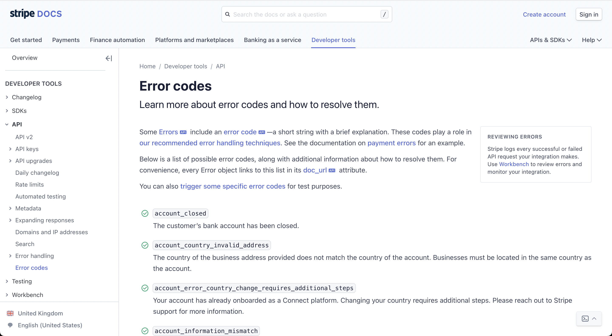
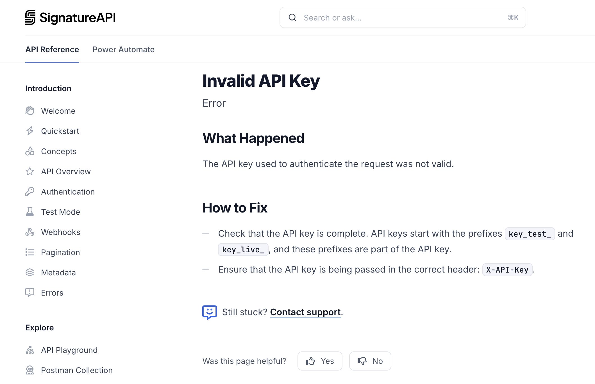

= Returning informative API Errors
:description: Design useful API errors to save clients time.

When building an API it's natural to put most of the focus into building a
beautiful "happy path" where nothing goes wrong. Developers often don't like to
consider the failure cases, because of course everything is going to work out
just fine, so errors are often not designed with the same care as the rest of
the API.

Errors in an API are not just an edge-case, they are a crucial part of the
functionality, and should be treated like a core feature to be proudly shared
and documented with users. Failing clearly and concisely is arguably more
important than any other aspect of API design.

Errors should:

* Be as detailed as possible.
* Provide context as to exactly what went wrong, and why.
* Help humans find out more information about the problem.
* Help computers decide what to do next.
* Be consistent across the API.

== HTTP Status Codes

The journey to great errors starts with link:/api-design/status-codes[status
codes]. Status code conventions exist to specify what
category of error has occurred, and they are a great way to help developers
make decisions automatically based on the status code, like automatically
refreshing access tokens on a `403`, or retrying the request on a `500`.

Learn more about link:/api-design/status-codes[HTTP Status Codes], and how to use
them effectively.

== Application Errors

HTTP status codes only set the scene for the category of issue that has
occurred. An error like `400 Bad Request` is generally used as a vague catch-all
error that covers a whole range of potential issues.

More information will be required to help developers understand what went wrong,
and how to fix it, without having to dig through logs or contact the support
team.

Error details are useful for:

. humans - so that the developer building the integration can understand the issue.
. software - so that client applications can automatically handle more situations correctly.

Imagine building a carpooling app, where the user plans a trip between two
locations. What happens if the user inputs coordinates that which are not
possible to drive between, say England and Iceland? Below is a series of
responses from the API with increasing precision:

[,http]
----
HTTP/1.1 400 Bad Request
----

A not very helpful error response, the user will have no idea what they did
incorrectly.

[,http]
----
HTTP/1.1 400 Bad Request

"error": {
    "message": "Trip is not possible, please check start/stop coordinates and try again."
}
----

This message could be passed back to the user which will allow them to figure
out how to address the issue, but it would be very difficult for an application
to programmatically determine what issue occurred and how to respond.

[,http]
----
HTTP/1.1 400 Bad Request

"error": {
    "code": "trip_not_possible",
    "message": "Trip is not possible, please check start/stop coordinates and try again."
}
----

Now this includes data that can help our users know what's going on, as well as
an error code which let's them handle the error programmatically if they would
like to.

So, we should always include both API error messages, as well as API error
codes. Let's take a closer look at the best practices for each of these.

== API error messages

API error messages should be clear, concise, and actionable. They should provide
enough information for the developer to understand what went wrong, and how to
fix it.

Here are a few best practices for API error messages:

* *Be Specific*: The error message should clearly explain what went wrong.
* *Be Human-Readable*: The error message should be easy to understand.
* *Be Actionable*: The error message should provide guidance on how to fix the issue.
* *Be Consistent*: Error messages should follow a consistent format across the API.

== API error codes

The use of an error code is well established in the API ecosystem. However,
unlike status codes, error codes are specific to an API or organization. That
said, there are conventions to follow to give error codes a predictable
format.

Stripe's error codes have a nice easy to understand structure. Each error has a
code which is a string, and a message which is a string, and that string is
documented online so it can be understood, or reported to support.

[,http]
----
HTTP/1.1 400 Bad Request

{
  "error": {
    "code": "trip_too_short",
    "message": "This trip does not meet the minium threshold for a carpool or 2 kilometers (1.24 miles)."
  }
}
----

This makes it easy for developers to react programatically to the error too:

[,typescript]
----
if (error.code === 'trip_too_short')
----

== Complete Error Objects

Include a `code` and a `message` puts an error message off to a great start, but
there's more to be done to turn errors into a handy feature instead of just a
red flag.

Here's the full list of what an API error should include:

* *Status Code*: Indicating the general category of the error (4xx for client errors, 5xx for server errors).
* *Short Summary*: A brief, human-readable summary of the issue (e.g., "Cannot checkout with an empty shopping cart").
* *Detailed Message*: A more detailed description that offers additional context (e.g., "It looks like you have tried to check out but there is nothing in your cart").
* *Application-Specific Error Code*: A unique code that helps developers programmatically handle the error (e.g., `cart-empty`, `ERRCARTEMPTY`).
* *Links to Documentation*: Providing a URL where users or developers can find more information or troubleshooting steps.

Some folks will build their own custom format for this, but let's leave that to
the professionals and use existing standards: https://www.rfc-editor.org/rfc/rfc9457.html[RFC 9457 - Problem Details for
HTTP APIs]. This is being used by
more and more API teams.

[,json]
----
{
  "type": "https://signatureapi.com/docs/v1/errors/invalid-api-key",
  "title": "Invalid API Key",
  "status": 401,
  "detail": "Please provide a valid API key in the X-Api-Key header."
}
----

This example of an error from the https://signatureapi.com/docs/errors[Signature
API] includes a `type`, which is basically
the same as an error code, but instead of an arbitrary string like
`invalid-api-key` the standard suggests a URI which is unique to the API (or
ecosystem): `+https://signatureapi.com/docs/v1/errors/invalid-api-key+`. This does
not have to resolve to anything (doesn't need to go anywhere if someone loads it
up) but it _can_, and that covers the "link to documentation" requirement too.

Why have both a `title` and a `description`? This allows the error to be used in
a web interface, where certain errors are caught and handled internally, but
other errors are passed on to the user to help errors be considered as
functionality instead of just "Something went wrong, erm, maybe try again or
phone us". This can reduce incoming support requests, and allow applications to
evolve better when handling unknown problems before the interface can be
updated.

Here's a more complete usage including some optional bits of the standard and
some extensions.

[,json]
----
HTTP/1.1 403 Forbidden
Content-Type: application/problem+json

{
 "type": "https://example.com/probs/out-of-credit",
 "title": "Not enough credit.",
 "detail": "The current balance is 30, but that costs 50.",
 "instance": "/account/12345/msgs/abc",
 "balance": 30,
 "accounts": ["/account/12345", "/account/67890"]
}
----

This example shows the same `type`, `title`, and `detail`, but has extra bits.

The `instance` field allows the server to point to a specific resource (or endpoint)
which the error is relating to. Again URI could resolve (it's a relative path to
the API), or it could just be something that does not necessarily exist on the
API but makes sense to the API, allowing clients/users to report a specific instance
of a problem with more information that "it didn't work...?".

The `balance` and `account` fields are not described by the specification, they
are "extensions", which can be extra data which helps the client application
report the problem back to the user. This is extra helpful if they would rather
use the variables to produce their own error messages instead of directly
inserting the strings from `title` and `details`, opening up more options for
customization and internationalization.

== Best Practices

Handling errors in API design is about more than just choosing the right HTTP
status code. It's about providing clear, actionable information that both
developers, applications, and end-users of those applications can understand and
act upon.

Here are a few more things to think about when designing errors.

=== 200 OK and Error Code

HTTP 4XX or 5XX codes alert the client, monitoring systems, caching systems, and
all sorts of other network components that something bad happened.

*The folks over at CommitStrip.com know what's up.*

Returning an HTTP status code of 200 with an error code confuses every single
developer and every single HTTP standards-based tool that may ever come into
contact with this API. now or in the future.

Some folks want to consider HTTP as a "dumb pipe" that purely exists to move data up and
down, and part of that thinking suggests that so long as the HTTP API was able to respond then thats a 200 OK.

This is fundamentally problematic, but the biggest issue is that it delegates
all of the work of detecting success or failure to the client code. Caching tools will cache the error. Monitoring tools
will not know there was a problem. Everything will look absolutely fine despite mystery weirdness happening throughout the system. Don't do this!

=== Single or Multiple Errors?

Should an API return a single error for a response, or multiple errors?

Some folks want to return multiple errors, because the idea of having to fix one
thing, send a request, fail again, fix another thing, maybe fail again, etc.
seems like a tedious process.

This usually comes down to a definition of what an error is. Absolutely, it
would be super annoying for a client to get one response with an error saying
"that email is in a bad format" and then when they resubmit they get another
error with "the name you sent has unsupported characters". Both those validation
messages could have been sent at once, but an API doesn't need multiple errors
to do that.

The error there is that "the resource is invalid", and that can be a single
error. The validation messages are just extra information added to that single
error.

[,json]
----
{
  "type": "https://example.com/probs/invalid-payload",
  "title": "The payload is invalid",
  "details": "The payload has one or more validation errors, please fix them and try again.",
  "validation": [
    {
      "message": "Email address is not properly formatted",
      "field": "email"
    },
    {
      "message": "Name contains unsupported characters",
      "field": "name"
    }
  ]
}
----

This method is preferred because it's impossible to preempt things that might go
wrong in a part of the code which has not had a chance to execute yet. For
instance, that email address might be valid, but the email server is down, or
the name might be valid, but the database is down, or the email address is
already registered, all of which are different types of error with different
status codes, messages, and links to documentation to help solve each of them
where possible.

=== Custom or standard error formats

When it comes to standards for error formats, there are two main contenders:

*RFC 9457 - Problem Details for HTTP APIs*

The latest and greatest standard for HTTP error messages. There only reason not
to use this standard is not knowing about it. It is technically new, released in
2023, but is replacing the RFC 7807 from 2016 which is pretty much the same
thing.

It has a lot of good ideas, and it's being adopted by more and more
tooling, either through web application frameworks directly, or as "middlewares"
or other extensions.

This helps avoid reinventing the wheel, and it's strongly recommended to use it
if possible.

*JSON:API Errors*

https://jsonapi.org/[JSON:API] is not so much a standard, but a popular
specification used throughout the late 2010s. It focuses on providing a common
response format for resources, collections, and relationships, but it also has a
decent https://jsonapi.org/format/#errors[error format] which a lot of people
like to replicate even if they're not using the entire specification.

*Pick One*

There has been a long-standing stalemate scenario where people do not implement
standard formats until they see buy-in from a majority of the API community, or
wait for a large company to champion it, but seeing as everyone is waiting for
everyone else to go first nobody does anything. The end result of this is
everyone rolling their own solutions, making a standard less popular, and the
vicious cycle continues.

Many large companies are able to ignore these standards because they can create
their own effective internal standards, and have enough people around with
enough experience to avoid a lot of the common problems around.

Smaller teams that are not in this privileged position can benefit from
deferring to standards written by people who have more context on the task at
hand. Companies the size of Facebook can roll their own error format and brute
force their decisions into everyones lives with no pushback, but everyone on
smaller teams should stick to using simple standards like RFC 9457 to keep
tooling interoperable and avoid reinventing the wheel.

=== Retry-After

API designers want their API to be as usable as possbile, so whenever it makes
sense, let consumers know when and if they should come back and try again., and if so, when. The
`Retry-After` header is a great way to do this.

[,http]
----
HTTP/1.1 429 Too Many Requests
Retry-After: 120
----

This tells the client to wait two minutes before trying again. This can be a
timestamp, or a number of seconds, and it can be a good way to avoid a client
bombarding your API with requests when it's already struggling.

Learn more about https://developer.mozilla.org/en-US/docs/Web/HTTP/Headers/Retry-After[Retry-After on MDN].
