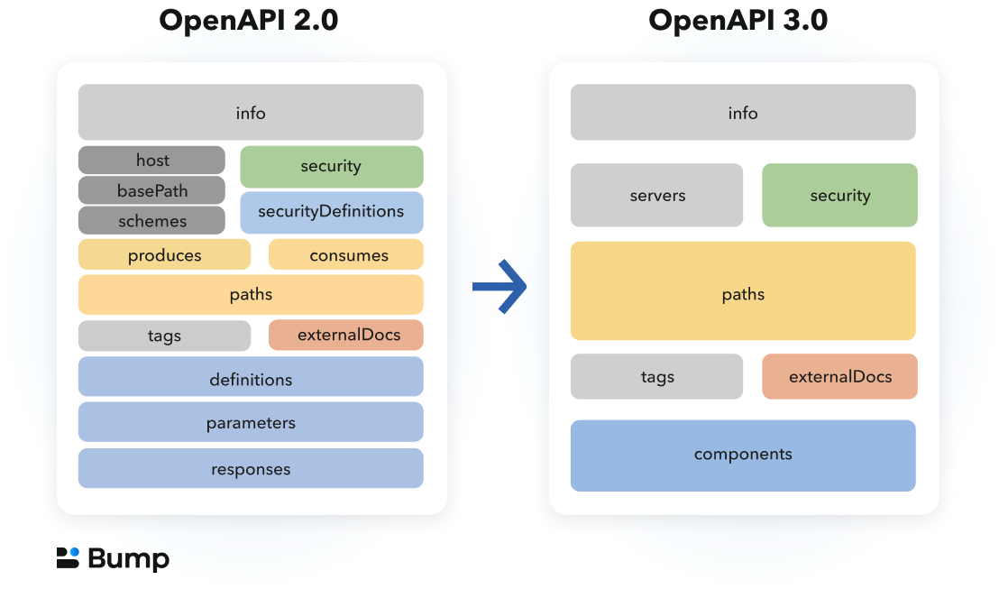

= What is OpenAPI
:description: OpenAPI describes how an Application Programming Interface (API) works, how a sequence of APIs work together, generate client code, create tests, apply design standards, deploy documentation, and much more.

OpenAPI is the hot new thing in the world of API Descriptions, but before we get stuck into learning it we need to take a step back and ask ourselves: what on earth are API Descriptions?

== API Descriptions

API descriptions are a way to write down what an API is meant to do, and how it
is meant to do it. They are a contract between the API developers and the client
that helps everyone understand what is going on without having to guess, or go
and hunt for some documentation somewhere.

=== Why Do We Need API Descriptions?

Let's use the fantastic https://pokeapi.co/[PokeAPI] as an example.

[source,javascript]
----
{
  "id": 12,
  "name": "butterfree",
  "base_experience": 178,
  "height": 11,
  "is_default": true,
  "order": 16,
  "weight": 320,
  "abilities": [{
    "is_hidden": true,
    "slot": 3
  }]
}
----

If we look just at the data, we can deduce that sure, ID is probably an
auto-incrementing identifier, the name seems to be a lower-cased English string,
but after that it starts getting a bit tricky.

Height and weight, I guess there is no imperial and metric in the game just
units, but what is order all about? The order that pokemon is sat in my current
party? That Ash bumped into in the cartoon? In order of cuteness? What?!

An API description can help answer most of the questions and more for anyone
wanting to understand how an API is meant to work.

- Which resources or methods are available and how do you interact with them?
- Which HTTP headers are required for that endpoint, for things like authentication?
- Which properties are available in the request and response?
- What are those various properties data types?
- Which of those properties are required or optional?
- What other validation rules can be applied to those properties?

Before API description formats like OpenAPI got popular for HTTP APIs, there were a
few common ways people would share information about how the API would work and
what it should do.

=== The Verbal Contract

A common case is the verbal contract, where the API developers discuss it with
the frontend or other client application developers as they go. The backend
developers write their code, the client developers write theirs, and as various
endpoints or properties are conceived, they are explained somehow: literally
explained out loud over the conference room table, shouted over a hail of nerf
gun pellets and ping pong, or DMed over Slack chats.

----
Fred: Hey Sarah, there's a new "fudge" field and it can be "blah" or "whatever".

Sarah: Great! Thanks I'll chuck that in now.
----

This might seem good enough as the API works, the app runs fine, the
project/product managers are happy, and the company may even be making money off
of this whole thing. Sadly this method has a bunch of downsides.

The primary issue is that communication is hard. You never really know if
somebody understood what you meant even if they say they did.

Beyond that, not having things written down means people can forget. If another
client team also needs the information and they ask another client team, they
are getting a copy of a copy which might be slightly wrong.

Another outcome is the original author(s) cannot remember the exact rules,
leading to time wasted checking the code. An even worse scenario is that the
original author(s) are not reachable for some reason. Maybe the whole team of
developers who worked on that API are all on a flight together from New York to
Uruguay, and for that entire 9 hour flight nobody can get any answers about how
the API is supposed to work, so they're stuck not being able to fix a production
issue... They might also have quit.

When folks rely on a verbal contract, two common things happen:

1. Developers waste time writing a new endpoint out of fear of using the old one
2. Developers waste time trying to guess the interface, and might guess wrong

== Shoddy Manual Descriptions

When folks first start thinking about descriptions, it often takes the form of
rudimentary API Reference Documentation. This might be dumped into a Google Doc,
shoved in a wiki, or written up in finger blistering HTML. These formats are
usually fairly painstaking to create, because you are focusing on formatting
_and_ content, shuffling things around whenever you remember that you should
list headers too, and copying and pasting examples of JSON which might change
over time. API developers would not settle for writing software like this, but
apparently when it comes to documentation it's accepted as the norm.

This whole slow, manual approach is probably why many people forgo writing
descriptions this way, and opt for verbal contracts instead. It probably would not
be a huge jump to say the "startup mindset" (and "agile") are one of a few
potential driving factors in this "just get on with it" approach. There are many
technical leaders inexperienced in this area telling their team "We'll write
lovely docs later when we've got more time!", without realizing their lack of
clarity is slowing down initial development, client integrations, increasing
testing efforts, and causing bizarre production issues and throughout their
ecosystem.

Anyway, aside from this medium of API descriptions being time consuming, it is also
impossible to enforce. After you have spent the time writing up a Google
Doc/HTML/Wiki, the only output of that is going to be... a Google Doc/HTML/Wiki
and maybe a PDF if you want to go wild. You can't exactly jam that Google Doc
into an API test suite and have it confirm that the API is conforming to
whatever is written in there.

There is another way: computer readable API Descriptions! 

== API Description Formats

A description format can be text-based or look a bit like a programming
language, but whatever form it takes, a description format lets you describe an
API in a reusable way in a predefined structure which loads of tools can
support, to make assist with pretty much everything :

- API Documentation
- Mock servers
- Breaking Change Detection
- Client-side validation
- Server-side validation
- Server/Application Code Generation
- Client-library Generation (SDKs)
- UI Generation
- Contract testing
- API Consoles / "HTTP Client" Collections
- Automated Style Guides
- Security/Compliance Sniffing

Written down exactly from an early point (and agreed upon) means that there are
far fewer surprises throughout the API lifecycle, from planning, through
development and throughout integration feedback.

Having a good description means that API developers can be confident that:

1. The interface is doing what they intend
2. The interface is going to be useful for client developers
3. The interface is understood well by client developers
4. The interface is not changing accidentally when code changes

This confidence will save everyone a lot of time, money and frustration. Having
no descriptions in place leads to slower rollout of the initial version, loads more
time spent testing subsequent deployments, and wasted developer time having
loads of meetings to explain things that could have been written down and clear
to everyone already.

An early example of that would be SOAP, which used something called a WSDL,
something discussed in the previous chapter.

[quote, Wikipedia]
____
The Web Services Description Language is an XML-based interface definition
language that is used for describing the functionality offered by a web service.
The acronym is also used for any specific WSDL description of a web service,
which provides a machine-readable description of how the service can be called,
what parameters it expects, and what data structures it returns. Therefore, its
purpose is roughly similar to that of a type signature in a programming
language.
____

WSDLs were only used for SOAP, and not many paradigms or implementations seemed
to bother with this sort of description format for a long time. Luckily that
has all changed over the last few years.

The HTTP API ecosystem has been trucking along working on a few approaches that
were loved by a small percentage of the API community, then GraphQL and gRPC
made API descriptions cool again by bundling them with their implementations. 

=== HTTP APIs: API Blueprint, RAML, OpenAPI

In the HTTP API world there were a few such as https://apiblueprint.org/[API
Blueprint], https://raml.org/[RAML], and https://openapis.org[OpenAPI] (at the
time called Swagger), but for years the tooling was a bit lacking, and mostly
only allowed for outputting as documentation.

OpenAPI v3.0 popped in 2015 up which solved a lot of problems with OpenAPI v2.0,
and beat the heck out of the other description formats. It took a few years for
tooling to catch up, but by 2018 pretty much everything supported OpenAPI v3.0,
and this description format settled as the mainstream favourite.

----
The OpenAPI Specification (OAS) defines a standard, programming
language-agnostic interface description for REST APIs, which allows both humans
and computers to discover and understand the capabilities of a service without
requiring access to source code, additional documentation, or inspection of
network traffic.
----

.An overly simplified example of OpenAPI describing an API which lists collections and resources of hats.
[source,yaml]
----
openapi: 3.0.2
info:
  title: Cat on the Hat API
  version: 1.0.0
  description: The API for selling hats with pictures of cats.
servers:
  - url: "https://hats.example.com"
    description: Production server
  - url: "https://hats-staging.example.com"
    description: Staging server

paths:
  /hats:
    get:
      description: Returns all hats from the system that the user has access to
      responses:
        '200':
          description: A list of hats.
          content:
            application/json:
              schema:
                $ref: '#/components/schemas/hats'

components:
  schemas:
    hats:
      type: array
      items:
        $ref: "#/components/schemas/hat"

    hat:
      type: object
      properties:
        id:
          type: string
          format: uuid
        name:
          type: string
          enum:
            - bowler
            - top
            - fedora
----

OpenAPI is a YAML or JSON based descriptive language which covers endpoints,
headers, requests and responses, allows for examples in different mime types,
outlines errors, and even lets developers write in potential values, validation
rules, etc.

Another popular language is http://json-schema.org/[JSON Schema], which parts of OpenAPI
are based on. The two are mostly compatible, and are both used for slightly different but complimentary things.

OpenAPI can describe both service and data model, and JSON Schema mainly only
defines the data model. In the example above, everything under `paths` is
describing the service model, then everything under `components.schemas` is
describing the data model. The schema keywords that OpenAPI v3.0 uses are based
on JSON Schema, and there is a bit of a tangent we should look into here about
compatibility.

OpenAPI documents are static files. They're usually stored in the same
repository as the source code, changes as API code is changed, reviewed as one,
then deployed off to OpenAPI documentation tools or S3 for other uses. Some
managers want to treat these like business secrets and hide them under lock and
key, which makes absolutely no damned sense as they are meta-data only. Most
"hackers" could probably figure out that you keep your list of companies under
`GET /companies`, so just don't make that a publicly available endpoint and
you're gonna be ok. PayPal, Microsoft, and other companies make their OpenAPI
descriptions available to anyone who wants to download them, and this approach
can help folks integrate with your APIs.

You can imagine an OpenAPI document growing to be rather unwieldy once its got 50+
endpoints and more complex examples, but have no fear you can spread things
around in multiple files to make it a lot more DRY (Don't Repeat Yourself) and
useful. The first thing to go is usually the `components.schemas` definitions,
which can be moved to their own files. Once these are split into their own
files, an extra step can be taken to turn them into proper JSON Schema files.
Once they are split out they can be referenced in a HTTP response header.

[source,http]
----
Link: <http://example.com/schemas/hat.json#>; rel="describedby"
----

When a client sees this they can use it for all sorts of things - like form
generation and client-side validation - all without needing to figure out how to
distribute the files to them ahead of time.

[[NOTE]]
====
One more note on OpenAPI and its old name Swagger. You still see the word Swagger floating around a lot. SmartBear, who purchased the "Swagger" API description format years ago, handed off management of the description format to the Open API Initiative. OpenAPI is the new name of the description format, but SmartBear still use the word Swagger for their tooling because of the brand recognition.

Since 2016, anyone calling it Swagger is out of date. The fact that folks keep using the word Swagger in 2019 is still a huge source of confusion. If you look for "Swagger tools" you will only find those from SmartBear, or really really out of date ones. Call it OpenAPI, search for OpenAPI, and we don't need to keep saying "OpenAPI/Swagger" like they are two alternative but equally valid things.
====

OpenAPI and JSON Schema are a fantastic pair, and we will show how to combine the two throughout the book.

==== GraphQL Schemas

GraphQL as an implementation comes bundled with
https://graphql.org/learn/schema/[GraphQL Schemas]. GraphQL does not really have
a service model, as it does not need one.

Seeing as most interactions operate under a
single HTTP endpoint like `POST /graphql`, there is no real need to
bother writing a contract around that in great detail. It would just be
mentioned in passing as an implementation detail, and the majority of the effort
would go into describing the data model.

NOTE: Some folks might have different endpoints for different use-cases, but
this is rarely spotted in the wild.

All the GraphQL documentation examples are Star Wars. Sure, it's obviously
inferior to Stargate SG-1, but let's reuse their examples for simplicity:

.An example of GraphQL schemas in the GraphQL Schema Language, implementing interfaces and sharing properties across different types.
[source,graphql]
----
interface Character {
  id: ID!
  name: String!
  friends: [Character]
  appearsIn: [Episode]!
}

type Human implements Character {
  id: ID!
  name: String!
  friends: [Character]
  appearsIn: [Episode]!
  starships: [Starship]
  totalCredits: Int
}

type Droid implements Character {
  id: ID!
  name: String!
  friends: [Character]
  appearsIn: [Episode]!
  primaryFunction: String
}
----

The syntax in this example is using the
https://facebook.github.io/graphql/draft/#sec-Type-System[GraphQL Schema
Language] (a.k.a IDL), but these files can be written in whatever programming
language the API is built in: JavaScript, PHP, Go, whatever.

Writing them in Go for example would make them a little tricky to interact with
for other languages, like trying to give these types to a JavaScript web-app. If
the client really needs them, a lot of the language-specific implementations
offer a way to "Dump" them to the IDL, which can then be read by the client with
the right tooling.

If dumping and distributing isn't a viable workflow,
https://graphql.org/learn/introspection/[introspection] can be used! This is
basically the process of quering the GraphQL API for information about the
schema, just like how `Link` is used to provide the client with the JSON Schema
in other HTTP APIs.

GraphQL schema does not support validation rules defined in the contract -
beyond required/optional/null like OpenAPI and JSON Schema, but there are some
extensions floating around which can help. More on all of that later.

==== gRPC: Protobuf

gRPC uses another Google tool for its API contract:
https://developers.google.com/protocol-buffers/[Protobuf]. Protobuf is basically
a serializer for data going over the wire. Much like GraphQL and its schemas,
Protobuf is integral to gRPC. Instead of schemas they call them "Message Types",
but it's all the same sort of idea.

Instead of writing them in whatever language the API is written in (like
GraphQL), a new `.proto` file is written using
https://developers.google.com/protocol-buffers/docs/proto[Protocol Buffer
Language Syntax]. This C-family/Java style language exists solely for writing
these files. It might be a bit of a pain to figure out a brand new syntax, but
it has the benefit of being fairly portable as you can read them in multiple
languages. Finding a JavaScript, Ruby, Python, Go, etc. tool that can read a
`.proto` file is a whole lot easier than trying to get Python to read something
written in  - for example - JavaScript.

Rarely are `.proto` files made available over a URL, they are usually bundled
and distributed with client code. Then usually things are kept backwards
compatible until the clients have upgraded whatever client code brought the
`.proto` files their way.

== Also Known as Contacts or Specifications

Some people talk about "API Specifications", or "contracts", and the APIs You
Won't Hate blog has been guilty of using these terms interchangeably. There a
lot of phrases floating around that mean different things to different people,
but there is consensus forming.

The term "specification" is used to mean a lot of different things. HTTP has a
specification, JSON has a specification, gRPC has a specification, most
programming languages have a specification, many people even use "message
formats" or "hypermedia formats" like JSON:API, HAL, or Protobuf, all of which
also have their own specification.

Some people argue that what we are calling a API Description is actually a
specification for _their_ API, and that is a valid argument, but with consensus
forming around API Descriptions being a nickname for a API Description Document
which uses a API Description Format, it's best to just keep on using that.

As for "contracts", when you use your API descriptions for contract testing, it
becomes a contract.

== Not using API descriptions is more work

Writing down descriptions might seem like a lot of work, but these days it should
no longer be considered as an optional step. The arguments against are usually based 
on a lack of understanding in how descriptions are created, when they are created, by 
whom, how, what stage of the API life cycle they're involved with, etc. 

Luckily this book has answers to all of that.

Flinging around arbitrary JSON and hoping people and other applications are all
using it properly over time is just reckless, selfish, and actually makes work
considerably more mundane. Creating API descriptions first with a decent editor, 
collaborating on them with client teams and stakeholders, creating docs and mocks, 
using them for contract testing, etc. drastically speeds teams up when they get the 
hang of it. 

Eventually you'll get to a point where you can't imaging working on an API without them,
like writing code which has absolutely not tests...

This introduction will most likely have left you with questions, and they will
be answered throughout the rest of the book.

== Ok fine, OpenAPI it is

OpenAPI (the "OpenAPI Specification") is a standard for describing an API. OpenAPI is managed by the https://www.openapis.org/[OpenAPI Initiative] (OAI). The https://spec.openapis.org/oas/v3.1.0[OpenAPI Specification] (OAS) defines an open and independent description format for HTTP API services, which allows both humans and computers to discover and understand how an API works and how to interact with it, without the need to look at the source code.

OpenAPI provides a machine-readable structured data format which can be also be read and written by people, allowing for tooling to help API developers, API product managers, technical writers, and governance teams, all the way through the API lifecycle.

// TODO image::images/openapi/specification/What-is-OpenAPI-Simple-API-Lifecycle-Vertical.png[A flow diagram showing Requirements > Design > Configure / Publish / Develop, then Deploy and Test.]

// _Diagram created by https://www.openapis.org/[OpenAPI Initiative]._

=== OpenAPI structure

Your OpenAPI documents lets you describe your REST API:

* Define general information about your API: description, terms of use, license, contact, etc...
* Authentication methods `HTTP`, `API keys`, `OAuth 2`, `OpenID`, etc...
* Available endpoints `/users`, etc...
* Since OpenAPI 3.1, https://bump.sh/blog/changes-in-openapi-3-1#webhooks-support[available webhooks]
* Available operations on each endpoint: `GET`, `POST`, `PUT`, `PATCH`, `DELETE`, etc...
* Input and output parameters for each operation

=== Description Format

OpenAPI documents can be written in https://yaml.org/spec/1.2.2/[YAML] or https://www.json.org/json-en.html[JSON] formats.

These formats were chosen because they are easy for a human to read and write, and easy for machines to parse. In practice, YAML is the most used format adopted to write OpenAPI documents. Like it or not, YAML is easier to read than JSON mainly because it reduces the use of markup tags. Also, it is a format that is widely used to write any sort of software configuration.

Here is an example of a partial OpenAPI document covering one endpoint, written in YAML:

[,yaml]
----
/previews:
  post:
    summary: Create a preview
    description: |
      Create a preview for a given documentation file. The preview will have a unique
      temporary URL, and will be active for 30 minutes.
    security: []
    requestBody:
      $ref: "#/components/requestBodies/Preview"
    responses:
      "201":
        description: "Success"
        content:
          "application/json":
            schema:
              $ref: "#/components/schemas/Preview"
----

=== OpenAPI Specification

_Also known as OpenAPI spec / OAS_

The "OpenAPI Specification" describes the https://github.com/OAI/OpenAPI-Specification[specification written and maintained] by the https://openapis.org/[OpenAPI Initiative], and published on https://spec.openapis.org/[spec.openapis.org]. This is a technical document that helps OpenAPI users and tooling vendors have one set of expectations about how things should work.

=== OpenAPI Document

_Also known as OpenAPI documents / OpenAPI file / OpenAPI description / OpenAPI contract_

An OpenAPI document describes how your API works, or how it will work when it's been built, and it's written following the OpenAPI specification. Think of this like a blueprint for your API. While an "API description" is a vague concept, OpenAPI Document is pretty concrete, it's where the OpenAPI that describes your API lives, and is usually something like `openapi.yaml` or `openapi.json`.

=== OpenAPI Documentation

_Also known as API Reference_

When you have an OpenAPI document one of the main things people do with it is create API documentation, more specifically "API Reference Documentation", which is human-readable technical documentation showing an end user all the relevant information about endpoints, requests, responses, etc. Your documentation can be automatically generated from your OpenAPI document to avoid the pain of writing it by hand.

== A brief history of OpenAPI

The OpenAPI Specification started off life with another name, and this can cause a bit of confusion. Until version 3.0, the specification was still called "Swagger", before being renamed to "OpenAPI" in 2016. It's actually a "retroactive" rename, so even v2.0 and earlier are called OpenAPI now.

The OpenAPI Specification is now supervised by the https://www.openapis.org/[OpenAPI Initiative], an open-source project under the https://linuxfoundation.org/[Linux Foundation].

The name Swagger is still popular, and many of the tools have the word Swagger in, but generally speaking you are better off searching for "OpenAPI tools" than "Swagger tools" because those are mostly old outdated tools which don't work with modern versions of OpenAPI.

== Major differences between OpenAPI 2.0, 3.0, 3.1

=== Versions

In the 2.0 specification, a property called `swagger` indicated which version of the specification you are using. In OpenAPI 3.0, this is replaced by a new `openapi` property:

* `swagger: "2.0"` line is thus transformed into `openapi: "3.0.0"`

=== Structural changes

The following image sums up the main structural changes between 2.0 and 3.0. As you can see, a simplification effort has been made to group each concern in a more logical way.

If you want to get more into the details about what changed between OpenAPI 3.0 and 3.1, you can have a look at https://www.openapis.org/blog/2021/02/16/migrating-from-openapi-3-0-to-3-1-0[migrating from OpenAPI v3.0 to v3.1] which I wrote for OAI.

== OpenAPI Benefits

OpenAPI is a game-changer for saving your team time and money. By automating routine tasks like creating detailed API documentation, generating client libraries and generating chunks of server-side code, even automating the checking of the API against style guides, it frees up your developers to focus on more important work. This means faster development and fewer hours spent on repetitive coding, which saves time and money as better quality APIs can be delivered quicker.

It also makes collaboration smoother and more efficient. With OpenAPI, you have a clear, consistent description of your API that everyone can follow. This reduces misunderstandings and miscommunications between different teams--whether they're front-end, back-end, or QA. Fewer mix-ups mean less time fixing errors and more time building great features.

When it comes to testing and validation, OpenAPI shines by enabling automated testing against your API specifications. This catches bugs early in the development process, which is cheaper and easier to fix than issues found later on. Reliable, bug-free APIs lead to happy users and less downtime, saving you from costly fixes and lost customers.

Onboarding new developers is made a lot more efficient with OpenAPI. The detailed documentation helps new team members or customers quickly understand how your APIs work, learning about key validation rules, cutting down on the "time to first request" by sharing sample HTTP requests in curl or code samples in various programming languages. Faster onboarding means new hires can start contributing sooner, and customers can start paying for use sooner.

=== API Design-First

In an xref:_guides/api-basics/dev-guide-api-design-first.adoc[API design-first world], OpenAPI allows you to describe your whole API from endpoints to examples before even writing the first line of code.

Using this approach, OpenAPI becomes the cornerstone of your API, and becomes the single source of truth in your organization. Code is based on what has been validated during the design phase, and the documentation is generated and synced with the OpenAPI document by deploying updated docs when new commits are merged.

Your team can collaborate at every step of the API design phase and leverage their workflow:

* Business and product teams can specify new features that meet consumers needs and a technical writer or an engineer can create or update the OpenAPI documents. Teams can https://bump.sh/blog/api-design-first-with-bump-diff#collaborating-on-api-design[discuss the changes], test the impacts and validate them.
* The API design process is boosted: frontend and backend developers can use the OpenAPI file to start working on the implementation, even if this is not the final version of the document.

=== Code-first

Obviously, we can't talk about API Design-First without mentioning the previous popular approach of Code-First, as it can have some benefits as well.

If you need to deploy an API fast for a MVP, internal use or with few endpoints, spending time on API design before you start coding may not be necessary and may slow your delivery time.

As developers, we have our rooted habits and Code-First follows the historical development process. We put ourselves directly into coding, without the need to learn yet another language or design tools to create our APIs. Sometimes it is a great time saver.

== Tools for OpenAPI

There are many tools to help you get the most out of OpenAPI, at every step of the API life cycle, here is a selection of our preferred ones:

=== Editors

* https://mermade.github.io/openapi-gui/[OpenAPI-GUI]
* https://stoplight.io/studio/[Stoplight Studio]
* https://editor.swagger.io/[Swagger Editor]
* https://insomnia.rest/[Insomnia]

=== Linters

* https://github.com/stoplightio/spectral[Spectral]
* https://quobix.com/vacuum/[Vacuum]

=== Documentation

* https://bump.sh/api-documentation[Bump.sh] 💙
* https://github.com/swagger-api/swagger-ui[Swagger UI]
* https://github.com/Redocly/redoc[Redoc]
* https://readme.com/[Readme]

=== Mocking

* https://microcks.io/[Microcks]
* https://github.com/stoplightio/prism[Prism]
* https://pb33f.io/wiretap/[Wiretap]

=== Testing

* https://microcks.io/[Microcks]
* https://www.postman.com/api-platform/api-testing/[Postman]

=== Clients generator

* https://github.com/OpenAPITools/openapi-generator[OpenAPI Generator]

=== Observability

* https://www.akitasoftware.com/[Akita]
* https://useoptic.com/[Optic]

Besides the ones mentioned above, here is an amazing and more exhaustive list of curated tools for OpenAPI: https://openapi.tools/ maintained by the APIs You Won't Hate community.

== Give it a try

Now that you know what OpenAPI is, try it out with one of the following OpenAPI documents.

* https://raw.githubusercontent.com/bump-sh-examples/train-travel-api/main/openapi.yaml[Train Travel API]
* https://developers.bump.sh/source.json[Bump API]

After you've had a quick look around one of those, lets start picking through the structure so we can learn properly.
