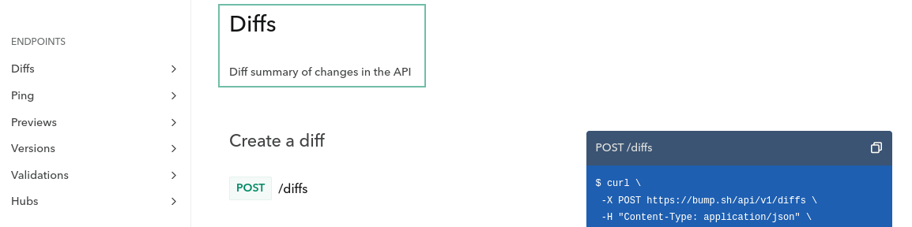
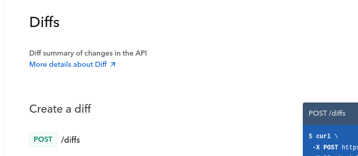
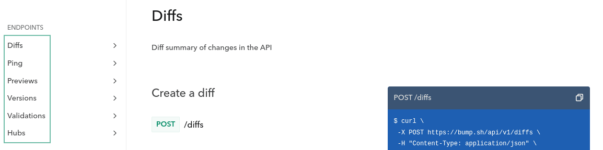
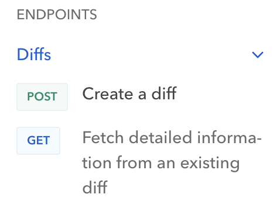
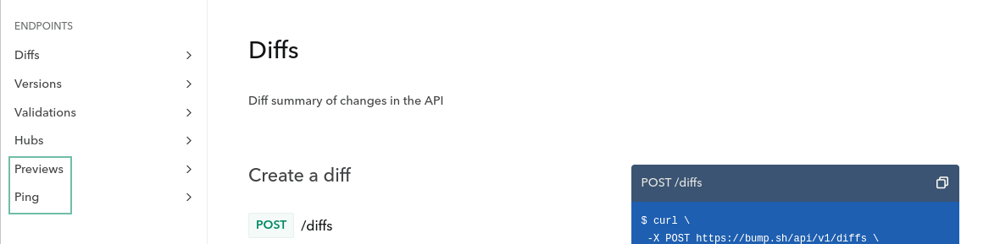

= Documenting with OpenAPI

Stuff

== Descriptions and Summaries

Often, API documentation is left to the end of the schedule, which can lead to a rushed set of API reference documentation. This results in terse outlines of what endpoints and parameters exist, but leave out the specifics of your well-designed and implemented API operation. One of the major ways to improve the developer experience is to upgrade your OpenAPI from being a quick list of parameters into a store of import context and human knowledge with expanding descriptions and summaries.

=== Example of Incomplete Documentation

For example, an operation might be described simply as `GET /users` with no further explanation, leaving users to guess what the endpoint does.

*Example Mistake:*

[,yaml]
----
paths:
  /bookings:
    get:
      summary: Get bookings
      parameters:
        - in: query
          name: offset
          schema:
            type: integer
            default: 10
      responses:
        200:
          description: "OK"
----

This is barely useful. The summary is repeating "Get bookings" like thats not clear from the "get" and the "/bookings" which would be displayed in most documentation tools by default. The summary is a chance to add more human information, like an alt tag or a caption, for things that aren't already there.

Detailed and clear descriptions enhance understanding and usability. The improved version should thoroughly explain the operation, including its purpose, parameters, and response types.

*Improved Example:*

[,yaml]
----
paths:
  /bookings:
    get:
      summary: List bookings for user
      description: Returns a paginated list of trip bookings by the authenticated user.
      parameters:
        - in: query
          name: offset
          schema:
            type: integer
            default: 10
          description: >
            Used for pagination, the offset parameter allows you to skip
            through the dataset to load the next set of records.
      responses:
        200:
          description: "A paginated list of bookings with detailed information."
          content:
            application/json:
              schema:
                $ref: '#/components/schemas/Bookings'
----

Longer is not always better, and efforts to programmatically enforce the use of descriptions can lead to combative entries like "The User ID parameter contains an ID for a User" which no client wants to see. If you put some effort into building a culture around respecting the need for sharing context with your users, you can see quicker and more successful uptake of your API en masse. This has the handy benefit of reducing demands on the support teams as they have fewer confused users to help.

This example showed a few types of description, but you can put descriptions and summaries in quite a few places. Let's take a look.

=== Parameter Descriptions

Parameters often seem really obvious to the author but not so much when somebody is quickly trying to integrate a single endpoint. For example, here `origin` and `destination` could be anything. Coordinates? City names? Station Codes? Station IDs?

[,yaml]
----
  /trips:
    get:
      parameters:
        - name: origin
          in: query
          description: The ID of the origin station.
          required: true
          schema:
            type: string
            format: uuid
        - name: destination
          in: query
          description: The ID of the destination station.
          required: true
          schema:
            type: string
            format: uuid
----

Here the descriptions make that perfectly clear, regardless of which API documentation tool ends up being used to render this information.

Descriptions are also a handy place to be more specific with criteria for the data that may have been vague otherwise.

[,yaml]
----
  /trips:
    get:
      parameters:
      - name: date
        in: query
        description: The date and time of the trip in ISO 8601 format in origin station's timezone.
        required: true
        schema:
          type: string
          format: date-time
          examples: ['2024-02-01T09:00:00Z']
----

Here we have a `format: date-time` which should be displayed to users in API documentation and used in various other tools, and we have an example which shows what format it should look like, but if a user is then trying to configure their own code to use the right date format. If a client had to base it entirely off the example there is lots of room for error, but by clearly stating ISO 8601 in the description, a JavaScript user knows they could use `dateObj.toISOString()` instead of trying to make some other awkward format.

=== Adding Descriptions to Tags

Tags are often underutilized, but they are a great way to group operations for more structured navigation in most API documentation tools. These tags are also a great place to write longer form context on what these tags actually mean in your domain specifically. For example, the word "Account" can mean 10 different things inside a large organization depending on the department and the function, so it's good to be super clear about what they are.

[,yaml]
----
tags:
  - name: Stations
    description: |
      Find and filter train stations across Europe, including their location
      and local timezone.
  - name: Trips
    description: |
      Timetables and routes for train trips between stations, including pricing
      and availability.
  - name: Bookings
    description: |
      Create and manage bookings for train trips, including passenger details
      and optional extras.
  - name: Payments
    description: |
      Pay for bookings using a card or bank account, and view payment
      status and history.

      > warn
      > Bookings usually expire within 1 hour so you'll need to make your payment
      > before the expiry date
----

Here not only are we explaining the words, but we are helping people find where particular information lives, and providing important context, like that `Bookings usually expire within 1 hour` which would not have been known to the client otherwise.

=== Operations

APIs are rarely as simple as the CRUD ("Create, Read, Update, Delete") lense many API developers naturally try and view them through. They can sometimes start out that way, but keep these things in mind:

* Is the operation returning all records, or restricting data based on the authenticated user.
* Is the operation using pagination or not.
* Is there a default status being applied like `status=active`, and you need provide some other flag to change or remove the default.

Once you get into it, there's usually quite a lot to say about an operation beyond "Get the Thing".

[,yaml]
----
  /trips:
    get:
      summary: Get available train trips
      description: Returns a list of available train trips between the specified origin and destination stations on the given date, and allows for filtering by bicycle and dog allowances.
      parameters:
        - name: origin
          in: query
          description: The ID of the origin station
          required: true
          schema:
            type: string
            format: uuid
            examples: [efdbb9d1-02c2-4bc3-afb7-6788d8782b1e]
        - name: destination
          in: query
          description: The ID of the destination station
          required: true
          schema:
            type: string
            format: uuid
            examples: [b2e783e1-c824-4d63-b37a-d8d698862f1d]
----

Here the summary is fairly light on details, because that's more of a title for the operation, but you can often elude to a fair bit within a few words, then expand on all that in the description.

[,yaml]
----
  /bookings:
    get:
      summary: List bookings for user
      description: Returns a paginated list of trip bookings by the authenticated user.
----

=== Responses

Whether to go large in the response or not is not so clear cut. If you were explaining what was going to happen in the operation description, then the response is... that, which has already been explained. Duplicating that long form description in the response seems redundant.

Generally, a common practice is to keep descriptions short, and you can go two ways with this:

[,yaml]
----
  /bookings:
    get:
      summary: List existing bookings
      description: Returns a list of all trip bookings by the authenticated user.
      responses:
        '200':
          description: A list of bookings
        '401':
          description: Unknown user error
        '403':
          description: Forbidden from seeing list of bookings
----

This all seems a bit redundant, because the operation happy path is described at the top, and it's really the errors that need more explaining. Depending on how you are describing errors, they should be explaining themselves, so this is really either the place for context which could not exist anywhere else, or a chance to just keep it simple.

[,yaml]
----
  /bookings:
    get:
      summary: List existing bookings
      description: Returns a list of all trip bookings by the authenticated user.
      responses:
        '200':
          description: OK
        '401':
          description: Unauthorized
        '403':
          description: Forbidden
----

This is essentially just repeating the HTTP status code because you need to write something, but you can do whatever you like. Essentially the advice would be: keep response descriptions short, unless there's some really important context which has to be given to that specific endpoint, and then do whatever your API documentation tool is happy with. If it prefers shorter descriptions maybe put that context in the operation description.

== Organize API Endpoints with OpenAPI Tags

Tags are a great way to organize the API endpoints in your OpenAPI documents.

Typically, OpenAPI tags are used to group related endpoints in a meaningful way, such as by business function or logical objects. When using tags, you define an array of tags at the root of your document, like this:

[,yaml]
----
tags:
  - name: Stations
    description: |
      Find and filter train stations across Europe, including their location
      and local timezone.
    externalDocs:
      description: Read more
      url: http://docs.example.com/guides/stations
  - name: Trips
    description: |
      Timetables and routes for train trips between stations, including pricing
      and availability.
  - name: Bookings
    description: |
      Create and manage bookings for train trips, including passenger details
      and optional extras.
  - name: Payments
    description: |
      Pay for bookings using a card or bank account, and view payment
      status and history.

      > warn
      > Bookings usually expire within 1 hour so you'll need to make your payment
      > before the expiry date
----

Once you've created these tags, you can use them to group related endpoints in your API using the `tags` property on the endpoint as follows:

[,yaml]
----
paths:
  /stations:
    get:
      summary: Get a list of train stations
      tags:
        - Stations
  /trips:
    get:
      summary: Get available train trips
      tags:
        - Trips
----

You can also apply multiple tags to an operation:

[,yaml]
----
paths:
  /bookings/{bookingId}/payment:
    post:
      summary: Pay for a Booking
      tags:
        - Bookings
        - Payments
----

=== Benefits of OpenAPI Tags

Tags are a powerful tool for improving the usability of your OpenAPI document. Below are some of the ways using tags can help keep your OpenAPI document organized.

==== Tags Can Describe Endpoint Groups

When specifying your tags in the root level of your API contract, you can give context to the tag using the `description` property.
Let's take https://bump.sh/demo/doc/bump[Bump.sh API documentation]. Here is how the `Diffs` tag is created and described in https://developers.bump.sh[Bump.sh API Contract]:

[,yaml]
----
tags:
  - name: Diffs
    description: Diff summary of changes in the API
----

The documentation will show the `Diffs` property like this:

You can even use Markdown (CommonMark) in the description to make it more readable and informative.

==== Tags Can Link to Additional Documentation

While the `description` property is excellent for giving a little more information about a specific tag, you might need to provide additional documentation if the business logic or object represented by the tag is complex and requires further explanation. Let's take our Diffs example from above. You can provide a link to an external web page where you offer a more detailed explanation using the `externalDocs` property.

In the code snippet below, the `externalDocs` property provides a link to a URL using the `url` property. A description for the URL can also be specified using the `description` property.

[,yaml]
----
tags:
  - name: Diffs
    description: Diff summary of changes in the API
    externalDocs:
      description: More details about Diff
      url: /help/api-change-management/
----

When you generate API documentation for the API contract above, you'll see the link rendered like this:

==== Tags Can Order Endpoint Groups in Documentation

When specifying your OpenAPI or AsyncAPI tags in the root of your API contract, the order in which you list the tags will define the order in which they appear in the generated documentation. This ordering lets you sort the tags meaningfully.

[,yaml]
----
tags:
  - name: Diffs
    description: Diff summary of changes in the API
  - name: Ping
    description: Monitoring status endpoints
  - name: Previews
    description: Preview for documentation file
  - name: Versions
    description: Deploy your API contracts
  - name: Validations
    description: Check & validate your API contracts
  - name: Hubs
    description: Interact with your Hubs
----

When you generate API documentation, you'll notice the documentation orders the endpoint groups in the same way:

Note that link:/help/specifications-support/openapi-support/name-and-sort-resources/#group-by-tag[Bump.sh helps you order your endpoints and webhooks] using a "Group by tag" operation. It is actually the default behaviour of Bump.sh when you have these tags defined and have not selected an other sorting option for your Bump.sh API documentation.

Now that you understand what tags are and their benefits, you'll see some best practices you should follow when using OpenAPI tags in API contracts.

=== OpenAPI Tags Best Practices

==== Tag Everything

When using tags, make sure you tag all your endpoints.
Notice how all diff-related endpoints are tagged with the `Diffs` tag in this snippet:

[,yaml]
----
paths:
  /diffs:
    post:
      tags: [ Diffs ]
      summary: Create a diff
      # ...
  /diffs/{id}:
    get:
      tags: [ Diffs ]
      summary: Fetch detailed information from an existing diff
      # ...
----

You can https://developers.bump.sh/group/endpoint-diffs[see live] how they are all available under the section Diffs. By clicking the name of the section in the left menu, the tagged endpoints will show up.

Untagged endpoints will not show up under any big section represented by a tag of your documentation generated by Bump.sh

To ensure your endpoints remain logically grouped and ordered, always tag every endpoint, even if it means creating a tag for a single endpoint.

==== Make Every Tag Unique

When defining the list of tags in the root of your API contract, make sure not to duplicate tag names. Since the tag's `name` property links an endpoint to a tag, duplicate names are likely to confuse developers looking at the API contract.

The code snippet below contains the root Tag Object in an API contract. Notice how the `Validations` tag has been duplicated, and the second definition contains a different description to the first:

[,yaml]
----
tags:
  - name: Diffs
    description: Diff summary of changes in the API
  - name: Versions
    description: Deploy your API contracts
  - name: Validations
    description: Check & validate your API contracts
  - name: Hubs
    description: Interact with your Hubs
  - name: "Documentation change"
    description: Check & validate your API contracts
  - name: Validations
    description: Validate your API status
----

These duplicate tags would confuse anyone trying to understand your API contract, as they wouldn't know which of the two tag definitions an endpoint belongs to.

Instead, make sure you define and describe every tag only once in the root Tag Object, like in the snippet below:

[,yaml]
----
tags:
  - name: Diffs
    description: Diff summary of changes in the API
  - name: Versions
    description: Deploy your API contracts
  - name: Validations
    description: Check & validate your API contracts
  - name: Hubs
    description: Interact with your Hubs
  - name: "Documentation change"
    description: Check & validate your API contracts
----

==== Define All Your OpenAPI Tags in the Root Tag Object

The OpenAPI specification https://swagger.io/specification/#:~:text=A%20list%20of,MUST%20be%20unique[doesn't require you to define all your tags in the root Tag Object of your API contract]. This means you can add a tag to an endpoint without listing it in the root Tag Object, but this is a bad idea. You won't be able to control what order the OpenAPI tags should appear in, and you won't be able to add a description or provide a link to external documentation for that tag. It can also confuse developers browsing your API contract as they won't see a list of all the tags used in the API contract.

As an example, consider the code snippet below where the `Previews` and the `Ping` tags has not been included in the root Tag Object:

[,yaml]
----
tags:
  - name: Diffs
    description: Diff summary of changes in the API
  # Missing Previews tag
  # Missing Ping tag
  - name: Versions
    description: Deploy your API contracts
  - name: Validations
    description: Check & validate your API contracts
  - name: Hubs
    description: Interact with your Hubs

paths:
  /diffs:
    post:
      tags: [ Diffs ]
  /diffs/{id}:
    get:
      tags: [ Diffs ]
  /hubs/{hub_id_or_slug}:
    get:
      tags: [ Hubs ]
  /versions:
    post:
      tags: [ Versions ]
  /validations:
    post:
      tags: [ Validations ]
  /previews:
    post:
      tags: [ Previews ]
  /previews/{preview_id}:
    put:
      tags: [ Previews ]
  /versions/{version_id}:
    get:
      tags: [ Versions ]
  /ping:
    get:
      tags: [ Ping ]
----

When you generate the documentation, notice how the `Previews` and `Ping` sections are at the bottom of the list.

This incorrect ordering and lack of description will make this section much harder to understand for a developer consuming your API.

On the other hand, notice how every endpoint in the API contract below has a tag also defined in the root Tag Object:

[,yaml]
----
tags:
  - name: Diffs
    description: Diff summary of changes in the API
  - name: Ping
    description: Check the API status
  - name: Previews
    description: Preview changes to an API Documentation
  - name: Versions
    description: Deploy your API contracts
  - name: Validations
    description: Check & validate your API contracts
  - name: Hubs
    description: Interact with your Hubs

paths:
  /diffs:
    post:
      tags: [ Diffs ]
  /diffs/{id}:
    get:
      tags: [ Diffs ]
  /hubs/{hub_id_or_slug}:
    get:
      tags: [ Hubs ]
  /versions:
    post:
      tags: [ Versions ]
  /validations:
    post:
      tags: [ Validations ]
  /previews:
    post:
      tags: [ Previews ]
  /previews/{preview_id}:
    put:
      tags: [ Previews ]
  /versions/{version_id}:
    get:
      tags: [ Versions ]
  /ping:
    get:
      tags: [ Ping ]
----

By doing this, your documentation will display the endpoint groups in the correct order along with the tag's description.

=== Conclusion

In this article, you learned more about OpenAPI tags and their value in an API contract. You also learned that you can add descriptions and external documentation links to the tag. This article has also shown you some best practices to follow when using tags that can improve the quality of your generated documentation.

== External Documentation

While the `description` property is excellent for giving a little more information about a specific tag, you might need to provide additional documentation if the business logic by a part of the API is complex, or there are lists of possible values defined outside of the API.

If anything requires further explanation, you can provide a link to an external web page where you offer a more detailed explanation using the `externalDocs` property.

The `externalDocs` property is two things, a URL using the `url` property, and a `description` explaining what this link is about.

[,yaml]
----
tags:
  - name: Diffs
    description: Diff summary of changes in the API
    externalDocs:
      description: More details about Diff
      url: https://docs.bump.sh/help/api-change-management/
----

This is not limited to tags, `externalDocs` can be used on:

* Root Object
* Tag Object
* Operation Object
* Schema Object

Here's all of them being used all at once!

[,yaml]
----
openapi: 3.1.0
info:
  title: External Docs Everywhere!
  version: "1.0.0"

externalDocs:
  description: Guides & Tutorials
  url: https://docs.bump.sh/guides/

paths:
  /diffs:
    get:
      externalDocs:
        description: Learn more about Operations
        url: https://docs.bump.sh/guides/openapi/specification/v3.1/understanding-structure/paths-operations/

tags:
  - name: Diffs
    description: Diff summary of changes in the API
    externalDocs:
      description: More details about Diff
      url: https://docs.bump.sh/help/api-change-management/

components:
  schemas:
    Diffs:
      externalDocs:
        url: https://docs.bump.sh/guides/openapi/specification/v3.1/data-models/schema-and-data-types/
----

When you generate API documentation for the API description above, you'll see the link rendered like this:

