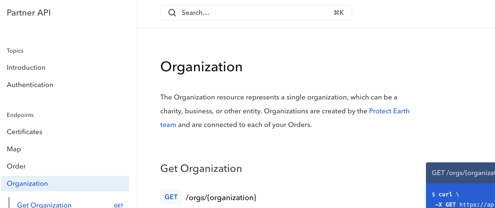
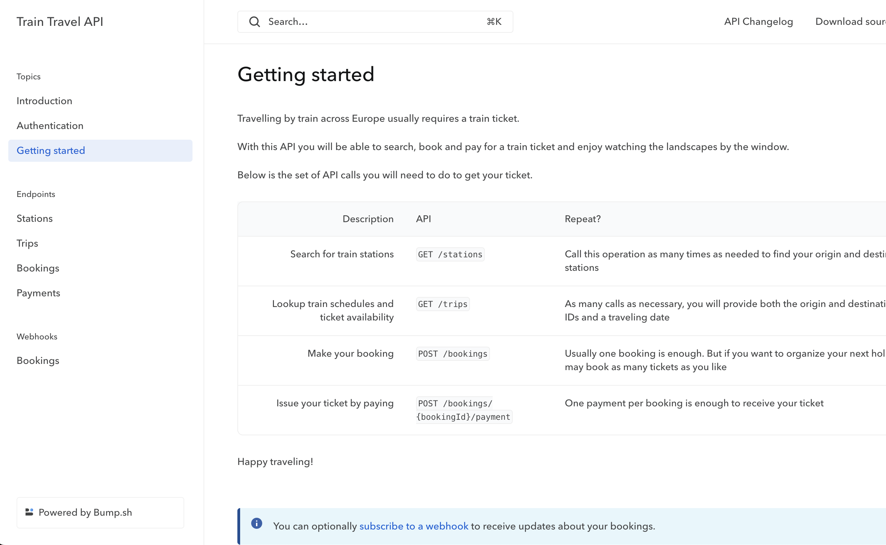

= Expanding OpenAPI

== Specification Extensions in OpenAPI

OpenAPI v3.1 has a concept of https://spec.openapis.org/oas/v3.1.0#specification-extensions[Specification Extensions] which are additional properties not specified by the OpenAPI specification. These are a chance to customize and integrate tools from documentation to API gateways, all hooking into the OpenAPI document and storing information important to them in the form of extra properties that will be ignored by other tooling.

All those properties start with the `x-` naming convention to be identified as "`eXternal`" from the OpenAPI specification.

=== Add a feedback link (`x-feedbackLink`)

The `x-feedbackLink` object can be added directly in the `info` object of your OpenAPI document. Find out more in our https://docs.bump.sh/help/publish-documentation/feedback/[dedicated section].

=== Add topics to your documentation (`x-topics`)

This vendor-specific property we created helps to add more context paragraphs in your generated documentation. Find out more in our link:/help/enhance-documentation-content/topics/[dedicated section].

=== Custom code sample examples (`x-codeSamples`)

____
This vendor extension is only available for OpenAPI documents for now
____

We added a custom property, not supported by OpenAPI, so you can add your own code samples in one or more programming languages to your documentation. Find out more in our link:/help/specification-support/doc-code-samples[dedicated section].

=== Expose your beta features (`x-beta`)

This custom property allows you to identify some components of your
documentation as beta. Find out more in our link:/help/specification-support/doc-beta[dedicated section].

== Extending OpenAPI Documents with Overlays

However you make OpenAPI descriptions for your APIs, there are all sorts of scenarios where you might want to customize it for different audiences. Perhaps your tech writers want to add amazing longer descriptions but they are locked out of the source code, or you want to hide some internal endpoints from your OpenAPI before publishing. Is it possible to do all this without awkwardly managing multiple similar-but-different OpenAPI documents?

The OpenAPI Initiative have released a new concept called "Overlays". This is https://github.com/OAI/Overlay-Specification[separate specification] but compatible with OpenAPI, and while it's labelled "experimental" its a v1.0.0, with support in a variety of tooling including https://bump.sh[Bump.sh].

[,yaml]
----
# overlays.yaml
overlay: 1.0.0
info:
  title: Improve Descriptions
  version: 0.0.1
actions:
  - target: '$.info.description'
    description: Provide a better introduction for our end users than this techno babble.
    update: >-
      Protect Earth's Tree Tracker API will let you see what we've been planting and restoring all
      around the UK, and help support our work by directly funding the trees we plant or the sites
      we restore.
      To get involved [contact us and ask for an access token](https://protect.earth/contact) then
      [check out the API documentation](https://protect.earth/api).
----

Using OpenAPI Overlays you can effectively "`patch`" an OpenAPI description, pointing to parts of the original document with https://www.rfc-editor.org/rfc/rfc9535[JSONPath], then adding or updating your content in. You can add as many actions to these overlays as you like, or make multiple overlays.

To work with Overlays you'll need a tool that understands them, and that's not all OpenAPI tools as the concept is still very new. Regardless of what API documentation tool you are using, you can use the https://github.com/bump-sh/cli[Bump CLI] to apply these overlays, and this will produce a new user-facing document.

 $ bump overlay openapi.yaml overlays.yaml > openapi.public.yaml

You can run these commands in continuous integration, and whatever you would have done with the original you can now do with the new `openapi.public.yaml` (or whatever you decide to name it).

Here's part of a GitHub Action used to deploy overlay-based improved documentation.

[,yaml]
----
name: Deploy documentation

on:
  push:
    branches:
      - main

jobs:
  deploy-doc:
    name: Deploy API doc on Bump.sh
    runs-on: ubuntu-latest
    steps:
      - name: Checkout
        uses: actions/checkout@v4

      - name: Apply overlay to API document
        run: |
          npx bump-cli overlay api/openapi.bundle.yaml api/overlays.yaml > api/openapi.public.yaml

      - name: Deploy API documentation
        uses: bump-sh/github-action@v1
        with:
          doc: partner-api
          token: ${{secrets.BUMP_TOKEN}}
          file: api/openapi.public.yaml
----

=== Adding more context with Overlays

Engineers will often focus very much on the "`how`", but leave out some of the "`why`", or really explain the "`what`", so if you have an existing OpenAPI document you cannot edit directly, try adding in some of these things with overlays.

==== Tags

Tags are a really useful place to explain some of the concepts being used. For example an Order and an Organization might seem fairly obvious what it is to the engineers working on it, but you could add context to them.

Here's an example of an overlay you could use to expand the tag. Descriptions with a whole bunch of Markdown, and links to other resources.

[,yaml]
----
# overlays.yaml
overlay: 1.0.0
info:
  title: Expand Tag Descriptions
  version: 0.0.1
actions:
  - target: '$.tags[?(@.name=="Order")]'
    description: Provide more information for Order tag.
    update:
      description: >
        The Order resource represents a single order for trees, which can be fulfilled by one or more
        deliveries. Orders are created by the [Protect Earth team](https://protect.earth/contact) and
        are used to track the progress of your order from creation to delivery.
  - target: '$.tags[?(@.name=="Organization")]'
    description: Provide more information for Organization tag.
    update:
      description: >
        The Organization resource represents a single organization, which can be a charity, business,
        or other entity. Organizations are created by the [Protect Earth team](https://protect.earth/contact)
        and are connected to each of your Orders.
----

These descriptions (which can be much longer and full of even more Markdown) will then show up in API Documentation, pride of place, ready to explain the concepts to the user before they get stuck into what specific endpoints are about.

Here's the tag description rendered in Bump.sh.

==== Introductory Topics

There are quite a few handy "`vendor extensions`" around which you can add more power to any tooling that knows how to respond to them. One particularly useful one is `x-topics`, which allows tech writers (or anyone else messing with this sort of work known as "`doc ops`" or "`spec ops`") to expand on just the API Reference Documentation, and start introducing end-users to other guides and content.

[,yaml]
----
openapi: 3.1.0

x-topics:
  - title: Getting started
    content:
      $ref: ./docs/getting-started.md
----

In http://Bump.sh[Bump.sh] this will create a new navigation entry, and insert the Markdown content from the reference guide right into the main documentation.

Whether you inject `x-topics` with Overlays or directly into OpenAPI in the source code, the result is the same.

==== Code Samples

There's countless other improvements you can make to the source OpenAPI given to you by the engineering teams who have other things to be worrying about, like link:/help/specification-support/doc-code-samples/[adding client-side code samples] with `x-codeSamples`.

[,yaml]
----
paths:
  /users:
    get:
      summary: Retrieve a user
      operationId: getUserPath
      responses: [...]
      parameters: [...]
      x-codeSamples:
        - lang: ruby
          label: Ruby library
          source: |
            require "http"

            request = HTTP
              .basic_auth(:user => "name", :pass => "password")
              .headers(:accept => "application/json")

            response = request.get("https://api.example.com/v1/users")
            if response.status.success?
              # Work with the response.body
            else
              # Handle error cases
            end
----

==== External Documentation

You could add `externalDocs` to point them to tutorials hosted elsewhere.

[,yaml]
----
tags:
  - name: Stations
    description: Train Stations all over Europe, using a bunch of standards defined elsewhere.
    externalDocs:
      url: https://train-travel.example.com/docs/stations
----

Filter out anything that shouldn't be there, like beta endpoints that are not ready for public use. There's a few ways to do this.

http://bump.sh[Bump.sh] users can do this with the `x-beta` property:

[,yaml]
----
paths:
  /diffs:
    post:
      description: Create a diff between any two given API definitions
      x-beta: true # Beta flag at the operation level
      requestBody:
        description: The diff creation request object
        content:
          application/json:
            schema:
              type: object
              x-beta: true # Beta flag at the top-level schema object
              properties:
                url:
                  type: string
                  format: uri
                  x-beta: true # Beta flag at the object property level
                  description: |
                    **Required** if `definition` is not present.
                    Current definition URL. It should be accessible through HTTP by Bump.sh servers.
----

Or you can filter them out with overlays:

[,yaml]
----
overlay: 1.0.0
info:
  title: Remove beta flags
  version: 0.0.1
actions:
  - target: "$..[?(@['x-beta'] == true)]^"
    description: Remove anything beta
    remove: true
----

____
Learn more about working with JSONPath to write powerful targets for your overlays in the guide https://docs.bump.sh/guides/openapi/jsonpath[How to work with JSONPath].
____

=== Summary

Overlays are powerful, advanced, and standardized across the toolchain, so you can rely on them to help you with any modifications you need to do.

Being able to change things however you like, then publish the changed versions off seamlessly is really handy, and will hopefully be the last time you need to do awkward JSON/YAML hacking on other peoples documents. JSONPath is a tricky thing to learn, but if you can master regex you can master JSONPath, then the world is your oyster.
