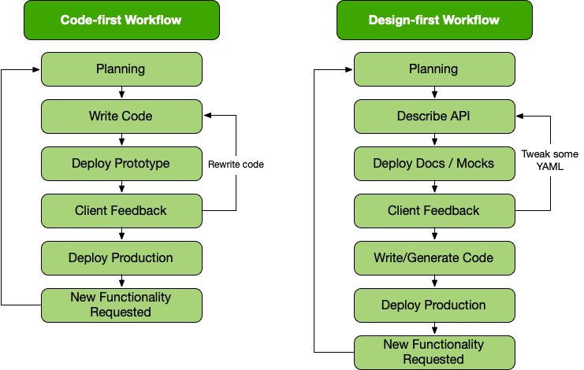

= Introduction to API Design-First

API Design-First, also known as "schema-first" or "contract-first", is all about designing the interface of an API before writing any code. It's about planning the "API contract", and defining what the API does and how it works so everyone's on the same page, all done before the implementation starts. This approach has been around for a while, and over time, it's evolved to meet the needs of different technologies. These days, OpenAPI has become the defacto standard for designing REST APIs, and AsyncAPI has become the defacto standard for describing event-driven APIs. This workflow can make life easier for everyone the whole way through the lifecycle of an API.

== A Brief History

To understand why design-first is such a big deal, it helps to know where it came from.

* *The early days: WSDL and SOAP*: In the late 90s and early 2000s, SOAP web services were popular, and people used the XML-based WSDL (Web Services Description Language) to describe them. WSDL files outlined all the operations and payloads in a verbose XML format. It was powerful, but many felt it was overly complex. Developers creating, maintaining, and using the APIs felt the frustration of working with them.
* *REST APIs take over*: REST, introduced in the early 2000s, focused on simplicity and scalability. Unlike SOAP, REST didn't have a standard way of describing APIs. Many developers relied on manual documentation, example cURL commands, or tools like Postman collections. It worked, but it was messy, inconsistent, and could easily diverge from the implementation of the API.
* *The OpenAPI era*: Around 2011, Swagger (later renamed OpenAPI) arrived to help describe REST APIs. It introduced a standard machine-readable format for defining operations, parameters, payloads, and validation rules, all using JSON or YAML. There were a few other similar projects (mainly RAML, API Blueprint) but they all fell out of use, and OpenAPI became the champion, especially with v3.0 and v3.1 improved on this base.
* *AsyncAPI*: In 2017, AsyncAPI released a v1.0 of a new specification to help event-driven architectures describe their APIs in a similar way to OpenAPI, in fact it was a fork. It includes support for common message brokers such as Apache Kafka and RabbitMQ amongst many others.

== What Is API Design-First?

API Design-First means defining the API's contract before writing any application code. This contract includes things like:

* The endpoints (URLs) and their HTTP methods (GET, POST, etc.)
* The structure and validation rules of resources and collections.
* Authentication rules (like API keys, OAuth 2.x, OpenID).
* Errors that could be expected, and an example of their structure.

At first this all seems like extra work, but much like writing tests for an application, it will eventually speed up the delivery of APIs, saving everyone time and money, and reduce costly rewrites onces not-quite-right APIs make it to beta, or even worse get into production.

== Why Design-First?

Here's why design-first is worth the effort:

. *Clear communication*: Everyone -- from frontend developers to testers to external users -- knows what the API does.
. *Parallel work*: Frontend and backend teams can work at the same time. Mock APIs can be set up using the design, so development doesn't have to wait.
. *Consistency*: It's easier to enforce standards when the contract is agreed upon first.
. *Automation*: You can auto-generate documentation, code snippets, and even parts of the implementation using tools.
. *Version control*: It's easier to track and manage changes to the API over time.

== When Are Descriptions Written, And By Who?

At what stage these descriptions are written, and by who, is very much up to the
culture of the organization. In some organizations the culture is "We dont
bother at all" and I've been there. I spent two years helping teams fix the
issues that came up from being vague about this stuff, and witnessed a lot of my
friends and colleagues waste time (and the companies time) guessing interfaces.

When I first got to that company, the culture relating to API descriptions was:

====
That's the thing that Phil keeps going on about, I think? Just ignore him. We've got unstable, untested, undocumented APIs full of problems to try and sort out. They're being misused by clients who don't really know how they work, meaning we're busy answering all of their questions and demands for changes to the functionality because we built a useless API before talking about their needs. No time for any of that design-first planning, just type `rails new` and write code as fast as it pops into your head. GO!
====

Two years later and that culture had changed substantially, to the point where
most older APIs had descriptions written down, and new ones invariably had
descriptions written before the work was started. Don't make me come to your office
and shout at you for two years, just start designing your APIs properly now.

Who should create and maintain descriptions? Whoever is creating and maintaining
the API. 

If one person is tasked with developing an API, then that is the one person who
should be writing the descriptions as part of the design phase, all of which 
should happen long before they start writing any code.

If a whole team is tasked with developing an API, then that team should split up
the design work between them.

When they should be created? As early as possible, in the repo that the code will 
eventually be pushed to, and they should be updated as part of the normal pull-request 
process as people work on code.

The planning process involved getting out a whiteboard, getting a few of your
clients in a room so you can listen to their needs (instead of just dictating
to them), get somebody who knows a bit more about systems architecture than the
average developer does (everyone thinks they're an expert), and hash out some
ideas.

When those ideas start to solidify, start writing things down, and turn those
notes into API descriptions. When they're ready, get them into a GitHub pull
request, or some other collaborative place, and folks on your team can start to
review them.

One of many benefits of creating descriptions before code is that they can be
processed by a "mock server", a HTTP server which plays make believe, and
emulates a theoretical future API by using the description documents. It knows what 
URLs will exist, which data is expected, if it should be JSON or something else, 
and what sort of responses should come back.

This sounds a little funny to many people who are used to just using API
descriptions to creating API reference documentation, but using descriptions just 
for documentation is like flying to Italy and eating at the airport.

At the previous job folks even started attaching service and data models to Jira
tasks,footnote:[Jira is a 'popular' piece of project management software from
Atlassian] meaning implementation was a lot easier as the "contract" was already
agreed upon. People could take the description to make a contract test, and just
write code to fill it in.

=== Too Late, We Already Have Code

Whenever the topic of API design-first comes up, somebody will say "Damn, that
sounds pretty good, but we already have an API written, and we didn't write down
the contract!"

Fear not. Some more strict languages like Go and Java have annotation-based
systems which can allow you to sprinkle some syntax around your applications to
generate some API descriptions. This approach does not work so well for dynamic
programming languages like Ruby because anything can be anything and you end up
having to write so much into comments and annotations, that you might as well
just be writing proper API descriptions.

There are a few tools out there which will help you create descriptions by
reading your HTTP traffic and inferring description from what it sees.

Use these tools to play catchup, then you can get into planning new features,
endpoints API versions, etc. with the design-first approach. Nobody will get mad
at you for not having a time machine, just don't use that as an excuse to not
bother designing things.

== API Description Formats and How They Help

Describing an API is the most important part of the API design-first workflow after planning is done, and for anyone building REST/RESTish APIs, the API description format of choice is OpenAPI. For anyone working with event-driven architectures the format of choice is AsyncAPI.

OpenAPI documents are written in JSON or YAML, making them machine-readable, and somewhat human-readable too. They contain all the information needed to describe the interface of an API: requests, responses, reusable components, etc.

[source,yaml]
----
 openapi: 3.0.0
 info:
   title: Example API
   version: 1.0.0
 paths:
   /users:
     get:
       summary: Get a list of users
       responses:
         '200':
           description: A list of users
           content:
             application/json:
               schema:
                 type: array
                 items:
                   type: object
                   properties:
                     id:
                       type: integer
                     name:
                       type: string
----

This snippet describes an API endpoint `/users` that responds with a list of users when a client sends a GET request. It then describes the responses a client could expect to see, with the status codes (e.g.: 200), content types (e.g.: `application/json`), then gets stuck into the `schema` which will outline the shape of the JSON.

If you're just getting started with OpenAPI, we're here to help you on your journey. We've put together a guide to help you https://docs.bump.sh/guides/openapi/specification/v3.1/understanding-structure/basic-structure/[learn OpenAPI from scratch], starting from the basic structure and going through every part of the functionality.

AsyncAPI works in a very similar way, but instead of describing endpoints you describe "publishers" and "consumers".

[source,yaml]
----
asyncapi: 3.0.0

channels:
  user/signedup:
    address: user/signedup
    messages:
      publishUserSignedUp.message:
        $ref: '#/components/messages/userSignedUp'

operations:
  publishUserSignedUp:
    action: send
    channel:
      $ref: '#/channels/user~1signedup'
    messages:
      - $ref: '#/channels/user~1signedup/messages/publishUserSignedUp.message'
----

== Comparing Design-first and Code-first

For years the API Code-first approach was the way to build an API. You'd sketch out the API you want to build on a whiteboard, then before that was even done somebody would be generating controllers and views in their favourite programming language and firing JSON around. The goal was always to get coding as fast as possible, so that clients could start integrating with it as soon as a prototype was ready.

The rush to get coding often meant the first version clients get to see is not really anything like what they want, so a lot of time gets lost and wasted recoding controllers and doing database migrations. At some point everyone runs out of time and they have to go to production with whatever they have, even if it's a mess for clients to work with, and everyone just agrees to fix it all later in v2.0...

For example, when OpenAPI is utilized in this approach, it is usually as annotations or code comments, popped into the application somewhere near the code it's describing, with the hope being that a developer will remember to update both at the same time. These annotations can then be exported to an `openapi.yaml` document which can be displayed as documentation or generate SDKs.

[source,ruby]
----
class UserController {
   @OpenApi(
       path = "/users",
       method = HttpMethod.POST,
       // ...
   )
   public static void createUser(Context ctx) {
       // ...
   }
}
----

Sadly this approach relies entirely on conflating proximity with accuracy. The annotations and code just a few lines below would often tell two completely different stories.

Anyone who has been building APIs for more than a few years has probably done this and felt the pain, which is why so many API teams are starting to leverage the API design-first workflow.

Here's a quick look at the two workflows for comparison.

Whilst there are a few more steps, the time invested on agreeing a contract early on brings massive time benefits through the rest of the API lifecycle.

Combining the API-Design-first workflow with OpenAPI/AsyncAPI specifically allows for amazing benefits:

. *Readable by humans and machines*: The YAML/JSON format means it's clear for developers and allows for API design reviews / governance with teams that don't have to read multiple programming languages.
. *Interactive docs*: API Documentation generators like Bump.sh turn OpenAPI/AsyncAPI documents into interactive documentation, showing off parameters and examples, so clients can quickly and easily work with the API.
. *Mock servers*: Tools like Microcks and Wiretap can use the API descriptions to simulate the API, allowing parallel development of API and client applications, and allowing feedback to come in early and often.
. *Server-side Validation*: Instead of rewriting all of your validation logic in docs and code, you can use the API descriptions to power your application, making absolute certain the the documentation matches the implementation and reducing time spent writing code.
. *Contract Testing*: Use automated tools to probe your API implementation based off the API descriptions, and add assertions to existing test suites saying "does this response match what it says in the API description", further ensuring the two are in agreement and saving time writing complicated contract testing by hand.
. *Code generation*: Many tools generate client libraries or server stubs directly from an OpenAPI/AsyncAPI document, saving loads of time.
. *API Style Guides*: Style guides are hard to enforce against code, developers need to check them manually, but with OpenAPI/AsyncAPI you can enforce standards on the API from the very first endpoint that is described.

Anyone who has written API documentation by hand knows that it takes forever and is usually bad and outdated very quickly, so the fact that you have entirely accurate documentation from the start is a huge benefit for most teams.

These other benefits may not have ever been considered, they were just things that you spent infinite time doing by hand and had never even considered automating, but when you combine them altogether in a single workflow your team becomes unstoppable.

Speed and accuracy both go through the roof, reducing time, cost and client frustration with your API.

== TypeSpec Making OpenAPI Easier

If you're looking at this thinking "I want all of those benefits, but writing up a lot of YAML sounds annoying" then take a look at https://docs.bump.sh/guides/openapi/accelerating-youropenapi-spec-generation-with-typespec/[TypeSpec]. Released by Microsoft, TypeSpec is a TypeScript-based DSL (Domain-Specific Language) for designing HTTP APIs.

The main goal of TypeSpec is to split the language used for "design" and "description" in two. The design phase is more about ideating and things change quicker, and the description is more of an artifact of that process, but OpenAPI was essentially one language for both.

OpenAPI is more verbose than any DSL could be, because it's written in JSON/YAML and that has limitations. You end up with a lot of text files, and the more you split your API description into multiple documents, the trickier it can be to rename things and keep all references up to date.

Having the design phase handled with TypeScript allows rapid change to the whole model, with autocomplete, bulk renaming, and type-strict modelling of all your data.

Later when it comes time to deploy documentation, run mock servers, do security checks, lint with style guides, etc. then TypeSpec does not have anywhere near as much tooling as OpenAPI, so you can say "ok, that design looks good, export OpenAPI" and run it through all of those tools, getting the best of both worlds.

== Summary

API Design-First is all about getting the API's design nailed down before jumping into coding. It helps teams work faster, stay consistent, and avoid costly mistakes later on. OpenAPI has become the standard for REST APIs, making it easy to design, document, and manage APIs. AsyncAPI brings this same power to the event-driven API world. Tooling has evolved massively in the last few years to support these standards, so you aren't constantly having to convert things into multiple formats or try to duct-tape infinite tools together with no common source of truth.
