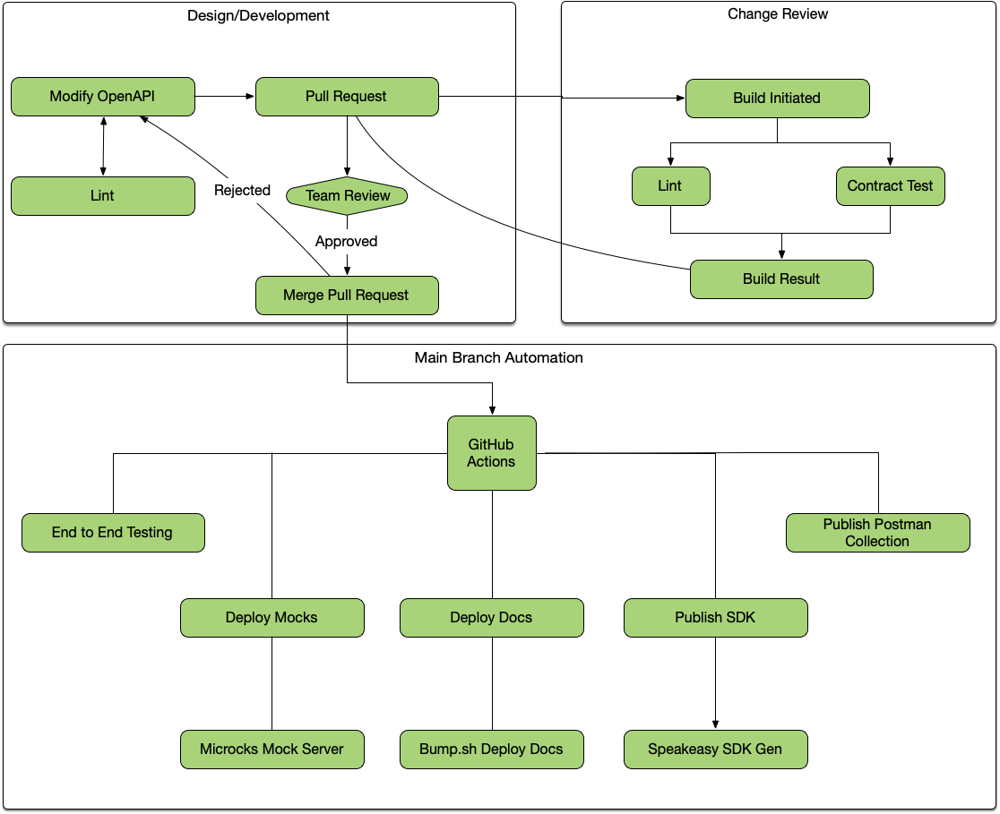
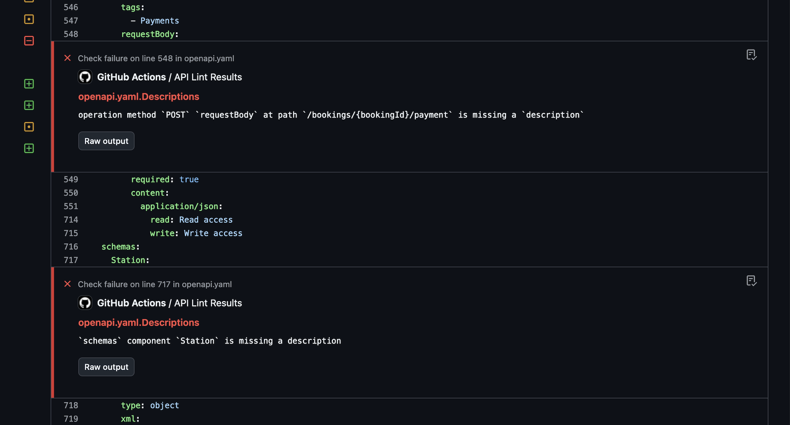
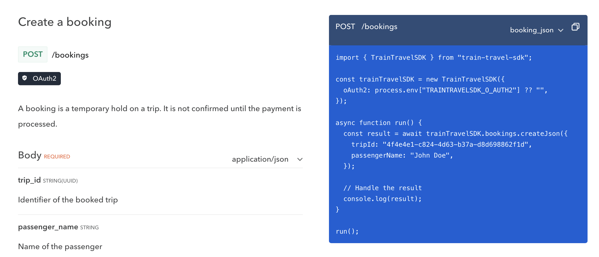
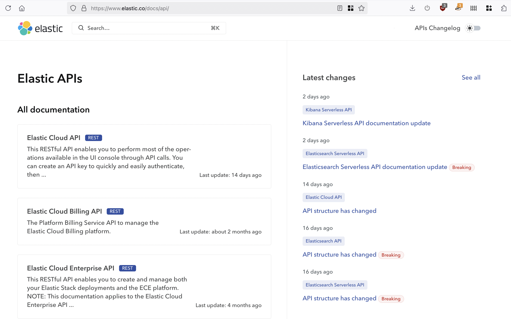
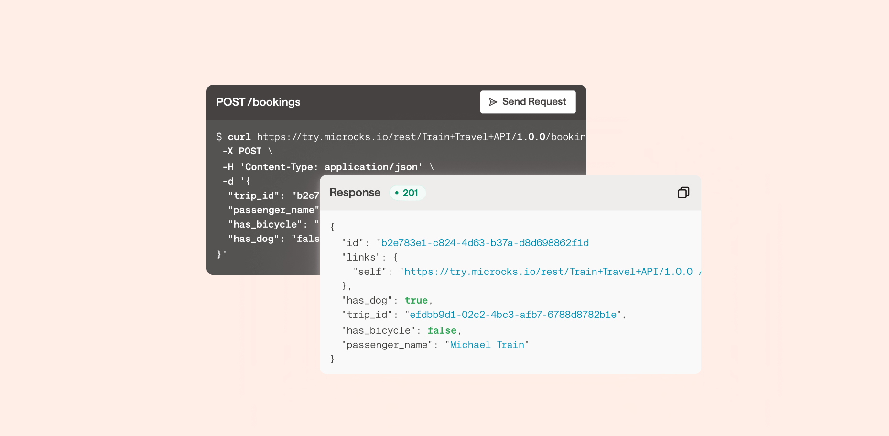

= The Perfect Modern OpenAPI Workflow

For decades designing and building APIs felt incredibly repetitive, because the
whole job seemed to be repeating the "I" in API (Interface) over and over again
in various formats. Every APIs would define all the endpoints, properties, data
types, values, and validation rules, in all the following places and more:

* Reference documentation
* Request validation
* Serializers
* Integration tests
* Contract tests
* Postman collections
* Client libraries

The whole job was just repeating "Yes, the `/trips` endpoint returns Trips and
they have these properties in this format" until you went blue in the face, and
any effort to automate this was converting infinite tricky formats into other
tricky formats, with often outdated tooling and a whole lot of duct tape.

== Modern OpenAPI To the Rescue

The HTTP API ecosystem has been revolutionized by OpenAPI, and the countless
tooling vendors who have stepped in to making amazing quality interoperable
tooling around it. Some people still seem to think OpenAPI is just about API
documentation, but as more and more tooling appeared OpenAPI has clearly defined
its time and cost savings throughout the API design and development process and
beyond.

OpenAPI is a machine readable declaration of the API interface, also known as an
API contract. This single source of truth is helpful the whole way through the
API lifecycle, from design to deployment to deprecation, and if it just so
happens that format is really good at outputting as API documentation then
that's not a bad thing.

== A Full Workflow with OpenAPI

Lots of folks use little bits of OpenAPI tooling in various manual ways, but
there is more to be done. Once OpenAPI is placed in version control, and tooling
is triggered via continuous integration, a truly amazing and powerful workflow
appears.

Here is the objectives for a truly useful OpenAPI workflow.

* One source of truth where API teams update the contract once.
* API Mocking - Easily spin up fake servers for clients to play around with to
see if that API design will hold up before time is wasted coding the wrong
thing.
* Automated Style Guides - Make sure APIs being designed/built match chosen
standards and conventions on commit or earlier.
* Beautiful API documentation - Every change should update API documentation
without having to remember to update a CMS or redistribute a PDF.
* Contract testing using any standard test runner: Jest, PHPUnit/Pest, JUnit,
RSpec.
* SDK Generators in popular languages to save every team pretending they know
how to code well in all those languages, which can be automatically kept up to
date as the API evolves.

This felt like a dream for years, but you can do all of this right now, and it's
not all locked behind one massive expensive walled garden.

== Git-centric Workflow

The vast majority of software is run through some sort of version control, and
this is the perfect place to put OpenAPI too: right in there with the source
code. This means that any OpenAPI change can go through a review process, and
once the actual API implementation has started being built it means the OpenAPI
and the code should always match, allowing for linting and testing.

Once the changes are merged to the main branch, it means documentation, mock
servers, SDKs, and anything else can all be updated along with the main
deployment of the source code, so there is no divergence between the code and
all these other artifacts.

Let's take a look at each of these stages of the API lifecycle, and how OpenAPI
tooling can help.

== Phase 1: Design & Development

=== Write OpenAPI

Create OpenAPI with some sort of editor. There are a few https://openapi.tools/#gui-editors[graphical
editors] available which make getting
started with OpenAPI considerably easier, but many of them assume you will
design an API, then export it, then never go back to the OpenAPI to update it.
They provide awkward importing through web interfaces, or complicated syncing,
or throw a bunch of confusing paywalls up, so many people prefer to use their
favorite editor.

https://code.visualstudio.com/[VS Code] is a popular choice, with the https://marketplace.visualstudio.com/items?itemName=42Crunch.vscode-openapi[OpenAPI
Editor]
extension by 42Crunch providing code navigation, linting, preview, IntelliSense,
schema enforcement, and a handy snippets feature to avoid repeating things. It
also has static and dynamic security analysis of the OpenAPI if you want to make
sure you're not making terrible mistakes early on.

=== API Linting

Linting an OpenAPI document is like linting any other source code. Using
OpenAPI-aware linters, syntax errors and semantic mistakes can be spotted, but
more importantly it helps to make sure that the API is of good quality, and the
OpenAPI that describes it is written properly, right from the start.

Linting can cover anything from enforcing naming conventions for endpoints or
properties, outlawing the use of auto-incrementing IDs, picking a single
versioning scheme across multiple APIs, improving documentation by making sure
endpoints have descriptions, requiring a specific data format like
https://jsonapi.org/[JSON:API] or
https://stateless.group/hal_specification.html[HAL], requesting API designers
stick to standards like https://www.rfc-editor.org/rfc/rfc9457[RFC 9457: Problem Details for
APIs], or anything else you can imagine
a rule being created for.

Tools like https://bump.sh/blog/api-linting-with-vacuum[vacuum] power this concept, and can be run locally using a CLI, or in Visual Studio using https://github.com/pb33f/vacuum-vscode[vacuum-vscode].

=== Server-side Validation

Once the API design has been approved and development begins on the API, the
OpenAPI is already right there in the repository so why not use it to avoid writing out all the same validation rules as code?

Some people have experimented with generating whole codebases from OpenAPI.
Maybe you'll have success with that, but folks are often scared off by the
confusion of trying to customize generated code before it is generated again
with future changes. Some tools allow for "hook in" points that allow for
customization without regenerating, but this can be feel restrictive.

A far more flexible approach comes with OpenAPI-aware HTTP middlewares. These
middlewares are able to look into the OpenAPI document, and compare incoming
HTTP requests based on the method and endpoint. From there it's a simple case of
rejecting the request if the URL parameters, query string parameters, or payload
body do not match the expected contract defined in the OpenAPI document.

For example, APIs built with Rails can use the https://rubygems.org/gems/openapi_first[openapi_first] gem to register a middleware, and point it to OpenAPI.

----
# config/application.rb

require_relative "boot"

require "rails/all"

module RailsDesignFirst
  class Application < Rails::Application
    config.middleware.use OpenapiFirst::Middlewares::RequestValidation, spec: 'api/openapi.yaml'
  end
end
----

From there, requests will be rejected if they are missing required properties or are otherwise invalid.

[,shell]
----
curl -X POST http://localhost:3000/widgets -H "Content-Type: application/json" -d '{}'
----

[,json]
----
{
  "title": "Bad Request Body",
  "status": 400,
  "errors": [
    {
      "message": "object at root is missing required properties: name",
      "pointer": "",
      "code": "required"
    }
  ]
}
----

If we try with a valid request now the OpenAPI middleware should let the request through, and the API should respond with a success.

[,shell]
----
curl -X POST http://localhost:3000/widgets -H "Content-Type: application/json" -d '{"name":"Replicator"}'
----

[,json]
----
{
  "id": 1,
  "name": "Replicator",
  "created_at": "2024-01-08T16:27:14.151Z",
  "updated_at": "2024-01-08T16:27:14.151Z"
}
----

Without needing to write any Ruby code at all, your API is rejecting invalid
requests, which is not only saving time writing code, but is making sure the
OpenAPI and code line up perfectly. It's pretty hard for code and docs to drift
when they're sharing a single source of truth like this.

_Learn more about https://docs.bump.sh/guides/openapi/design-first-rails/[using OpenAPI to simplify building Ruby on Rails APIs], with a https://docs.bump.sh/guides/openapi/design-first-laravel-php/[similar guide for Laravel PHP users]._

== Phase 2: API Governance

API Governance is the framework for making great, consistent, reliable, and
consumable APIs. Over the last decade, API governance has gone from some vague
concept being mentioned at conferences, to being a beautifully solved problem
with a plethora of tooling.

Whilst API governance is a massive
topic,
a few key parts can be handled with OpenAPI tooling, speeding up and partially
automating "API Design Reviews", simplifying change detection, automation of
"API style guides", and creating an API Catalog that can help keep track of all
the APIs in a company so they don't go missing and fall into disrepair.

=== API Design Reviews

Just as pull requests need to pass automated testing as well as being peer
reviewed, OpenAPI changes need to be reviewed to make sure they are a good idea
for the API, consumers, and organization at large. Design reviews make sure the
API is going to be useful not just valid. By making sure the OpenAPI is
suggesting a good change, more mistakes will be caught before they make it into
production.

This can be a very manual and time consuming process without OpenAPI as there is
a lot of code review, and the folks helping with design reviews might have to
learn various languages, multiple frameworks, and understand all the intricacies
of those frameworks less obvious conventions. Moving the review to OpenAPI
removes all of that, and helps to democratize and centralize the process and
have more folks involved, instead of just those who understand the code.

To design reviews easier, Bump.sh can show a list of relevant changes between
the OpenAPI in the a pull request and the latest deployed document. This helps
skip staring at infinite lines of YAML/JSON, trying to understand what, if
anything, meaningfully changed. New properties, changed property validations, or
breaking changes like a removed endpoint or new required property.

[,yaml]
----
# .github/workflows/api-changes.yaml
name: API Changes
permissions:
  contents: read
  pull-requests: write

on:
  pull_request:
    branches:
      - main

jobs:
  changes:
    name: Detect and preview API changes
    runs-on: ubuntu-latest
    steps:
      - name: Checkout
        uses: actions/checkout@v4

      - name: Comment pull request with API diff
        uses: bump-sh/github-action@v1
        with:
          doc: <BUMP_DOC_ID>
          token: ${{secrets.BUMP_TOKEN}}
          file: api/openapi.yaml
          command: diff
----

=== API Linting Again

Linting was used in the design and development phase, running locally in the CLI
or editor, but linting is useful in the governance phase too. By running API
linting on pull requests, much of the design review process can be automated.

For example, instead of wasting human time spotting naming convention issues, or
making somebody want to quit because their entire job is reminding API
developers "this endpoint does not have a description, please add one", the
robots can do that work instead.

Configuring the linter to return errors and warnings as annotations on the
problematic lines in a pull request makes it even easier, helping developers
spot the problems with their OpenAPI as quickly as they would any syntax errors
in their code.

Organizations can use this concept to produce their own
https://quobix.com/vacuum/rulesets/custom-rulesets/[rulesets], which are
basically the old idea of an API Style Guide, but instead of writing out a
manifesto which nobody will ever read, it can be an automated process. By adding
new rules over time as more problems pop up or best practices evolve, it helps
to iteratively improve not just the API in question, but all future and existing
APIs in the organization.

Let's combine this extra linting job with the previous API change workflow.

[,yaml]
----
# .github/workflows/api-changes.yaml
name: API Changes
permissions:
  contents: read
  pull-requests: write

on:
  pull_request:
    branches: [main]
  push:
    branches: [main]
    paths-ignore:
      - 'README.md'
      - 'src/**'

jobs:
  changes:
    name: Detect and preview API changes
    runs-on: ubuntu-latest
    steps:
      - name: Checkout
        uses: actions/checkout@v4

      - name: Comment pull request with API diff
        uses: bump-sh/github-action@v1
        with:
          doc: <BUMP_DOC_ID>
          token: ${{secrets.BUMP_TOKEN}}
          file: api/openapi.yaml
          command: diff

  lint:
    name: API Linting
    runs-on: ubuntu-latest

    permissions:
      statuses: write
      checks: write

    steps:
      - name: Checkout code
        uses: actions/checkout@v4

      - name: Install dependencies
        run: npm ci

      - name: Lint API
        run: npm exec vacuum report -- --junit openapi.yaml lint-results

      - name: Publish Lint Results
        if: success() || failure()
        uses: mikepenz/action-junit-report@v5
        with:
          check_name: API Lint Results
          report_paths: lint-results-*.xml
----

=== Contract Testing

Contract testing used to be complicated, with dedicated testing tools running in
isolation that had no knowledge of what the contract was meant to be until you
told it.

How would a testing tool know what properties were meant to be returned by any
particular endpoint in any particular state until it had been programmed in? How
would it be aware of changes made in a recent PR unless it was updated once it
broke?

Having OpenAPI in the same repository as the source code means that every single
commit carries with it a perfect description of what the API should be, so at
any point the existing API test suite should be able to use that OpenAPI for
comparison against what the code is actually returning.

For Rails users, this would take the form of the
https://rubygems.org/gems/openapi_contracts[openapi_contracts] gem. Once the
RSpec test runner is aware of where the OpenAPI document resides, a single
assertion can be added to existing tests to confirm the returned response
matches the API description.

[,ruby]
----
require "rails_helper"

RSpec.describe 'widgets', type: :request do

  describe "GET /widgets" do
    it 'responds with 200 and matches the doc' do
      get '/widgets'
      expect(response).to match_openapi_doc(OPENAPI_DOC)
    end
  end

end
----

Requests that were sent can also be validated to confirm both sides of the HTTP interaction.

[,ruby]
----
it do
  is_expected.to match_openapi_doc(
	  OPENAPI_DOC,
	  request_body: true
  ).with_http_status(:created)
end
----

Running this contract testing is done whenever the existing integration test suite is run.

[,yaml]
----
# .github/workflows/tests.yaml
name: Run RSpec tests
on: [push]
jobs:
  run-rspec-tests:
    runs-on: ubuntu-latest
    steps:
      - uses: actions/checkout@v4
      - name: Set up Ruby
        uses: ruby/setup-ruby@v1
        with:
          # runs 'bundle install' and caches installed gems automatically
          bundler-cache: true
      - name: Run tests
        run: |
          bundle exec rspec
----

If an API does not have an existing integration test suite this might seem like
a bigger push, but an API without a test suite should absolutely add one.
Working with a generic test suite and adding in some OpenAPI assertions can be a
great way to start off a larger test suite. Set up one HTTP request for each API
endpoint, with basic information, and add other tests for various scenarios over
time as bugs are squashed.

Another option to avoid that is to run contract testing outside of the codebase.
To avoid having to train a tool to know what the expected contract is, why not
use a tool which already knows what the latest OpenAPI is meant to be at
anytime: Microcks again!

Microcks handles contract testing as well as mock servers, and it does this by
taking a URL to a server for comparison. This could be staging, pre-production,
or even production if you're careful.

It works by going through all the operations in the OpenAPI document, and uses
the examples and schemas defined there to send a request that should work, to an
API instance of your choosing. This could be production if you are brave, or
some other staging/testing environment, but the logic is simple:

. Send HTTP requests.
. See if that fails unexpectedly.
. Receive HTTP response.
. See if that matches the OpenAPI document.

This could be automated to run at regular intervals, or it could be triggered to
run on pull requests and merges to make sure that any and all API or OpenAPI
changes agree with each other. GitHub Actions is once again a good way to get
this done.

[,yaml]
----
# .github/workflows/contract-testing.yml
name: API Contract Testing
on: [push]
jobs:
  contract-testing:
    name: Deploy API documentation on Bump.sh
    runs-on: ubuntu-latest
    steps:
      - name: Checkout
        uses: actions/checkout@v4

      - uses: microcks/import-github-action@v1
        with:
          specificationFiles: 'api/openapi.yaml:true'
          microcksURL: 'https://mocks.example.com/api/'
          keycloakClientId:  ${{ secrets.MICROCKS_SERVICE_ACCOUNT }}
          keycloakClientSecret:  ${{ secrets.MICROCKS_SERVICE_ACCOUNT_CREDENTIALS }}

      - uses: microcks/test-github-action@v1
        with:
          apiNameAndVersion: 'Train Travel API:1.0.0'
          testEndpoint: 'http://api-testing.example.com'
          runner: OPEN_API_SCHEMA
          microcksURL: 'https://mocks.example.com/api/'
          keycloakClientId:  ${{ secrets.MICROCKS_SERVICE_ACCOUNT }}
          keycloakClientSecret:  ${{ secrets.MICROCKS_SERVICE_ACCOUNT_CREDENTIALS }}
          waitFor: '10sec'
----

_Learn more about https://docs.bump.sh/guides/bump-sh-tutorials/testing-with-microcks/[contract testing with Microcks]._

== Phase 3: Deploying Artifacts

There are countless artifacts that need to be kept up-to-date with the API as it
is changed over time, and instead of doing any of this manually we can let
OpenAPI handle all of it.

=== Deploy Documentation

Using OpenAPI is the easiest way to maintain up-to-date documentation, without
having to remember to make manual changes to some wiki/CMS somewhere, or try to
time updates with code deployments. Tools like Bump.sh provide hosted API
documentation which can be updated every time the Git repo receives updated
OpenAPI.

As soon as a pull request is merged to the `main` branch, the OpenAPI document
that accompanies the source code can be deployed to the Bump.sh documentation,
keeping everything in sync.

[,yaml]
----
# .github/workflows/api-docs.yml
name: Deploy API documentation

on:
  push:
    branches:
      - main

jobs:
  deploy-openapi:
    name: Deploy API documentation on Bump.sh
    runs-on: ubuntu-latest
    steps:
      - name: Checkout
        uses: actions/checkout@v4

      - name: Deploy API documentation
        uses: bump-sh/github-action@v1
        with:
          doc: <your-doc-id-or-slug>
          token: ${{secrets.BUMP_TOKEN}}
          file: api/openapi.yaml
----

This keeps the API reference documentation always relevant, and because it's
been used for contract testing there cannot have been any "drift" between the
API implementation and the OpenAPI describing it, meaning the reference
documentation must be correct.

=== Deploy Mocks

There are countless API mocking tools out there, many of which work with OpenAPI
to save the manual effort of updating them every time an API changes, whether
that is throughout design and development phases, or later as the API evolves.

One such tool is Microcks, a self-hosted mock server with an admin interface and
easily accessible HTTP endpoints that simulate the API being described in
OpenAPI. You could log into that admin panel and let it know somebody has
updated the OpenAPI every now and then, but why not automate that to save time.

Using GitHub Actions to handle that update looks a bit like this:

[,yaml]
----
# .github/workflows/api-mocks.yml
name: Deploy API mocks
on:
  push:
    branches:
      - main
jobs:
  deploy-mocks:
    if: ${{ github.event_name == 'push' }}
    name: Deploy API mocks to Microcks
    runs-on: ubuntu-latest
    steps:
      - name: Checkout
        uses: actions/checkout@v4

      - uses: microcks/import-github-action@v1
        with:
          specificationFiles: 'api/openapi.yaml:true'
          microcksURL: 'https://mocks.example.com/api/'
          keycloakClientId:  ${{ secrets.MICROCKS_SERVICE_ACCOUNT }}
          keycloakClientSecret:  ${{ secrets.MICROCKS_SERVICE_ACCOUNT_CREDENTIALS }}
----

This workflow could be combined with other jobs, or it could be left as its own
workflow like this for clarity. Either way, whenever a change is made to the
`main` branch the mock servers will be updated and instantly reflect the latest
OpenAPI.

_Learn more about https://docs.bump.sh/guides/bump-sh-tutorials/mocking-with-microcks/[API mocking with Microcks]._

=== Publish SDKs

The quicker a customer can integrate with your API, the quicker your business
will be making money or solving problems. Some users will be happy to integrate
directly with the API, but many prefer the ease of working within the
programming language through Software Development Kits (SDKs).

These can be a lot of work to build and keep up to date, but OpenAPI allows API
providers to automate the creation of code libraries which allow API consumers
to work in their programming language of choice instead of poking and prodding
over HTTP directly.

SDK generation tools have been around for a long time, but in the past the best
offering was a cumbersome Java-based open-source tool where you generally had to
develop your own templates. Modern tooling like
https://www.speakeasy.com/[Speakeasy] and
https://www.stainless.com/[Stainless] allow API
providers to point to an OpenAPI document, and produce type-safe SDKs that your
team will be proud of. These will handle tricky functionality like OAuth 2,
retries, pagination, and even allow for adding custom code to the generated
output.

Generating SDKs whenever commits are merged to `main` allows for continuously
up-to-date accurate SDKs.

[,yaml]
----
# .github/workflows/sdks.yml
name: Publish SDKs
permissions:
  checks: write
  contents: write
  pull-requests: write
  statuses: write
  id-token: write
on:
  push:
    branches:
      - main
    paths:
      - .speakeasy/gen.lock
  workflow_dispatch: {}
jobs:
  publish:
    uses: speakeasy-api/sdk-generation-action/.github/workflows/sdk-publish.yaml@v15
    with:
      target: train-travel-sdk
    secrets:
      github_access_token: ${{ secrets.GITHUB_TOKEN }}
      npm_token: ${{ secrets.NPM_TOKEN }}
      speakeasy_api_key: ${{ secrets.SPEAKEASY_API_KEY }}
----

Speakeasy will not only automatically generate these SDKs on every push to the
`main` branch, but will tag versions as appropriate, and with a bit of other
setup these SDKs can be pushed directly to package managers like NPM, PyPI,
Packagist, NuGet, and Maven.

Once this is done, you can update API documentation on Bump.sh to include these
SDKs in the code examples, instead of the default of showing curl CLI examples,
or rudimentary code samples like using `fetch()` or other low-level HTTP code.

=== API Catalog

Another key part of API governance is discoverability, which usually takes the
form of "API Catalogs". Infinite awkward solutions have been employed in the
past. API teams have bodged together infinite awkward solutions with miles of
duct-tape, but Bump.sh makes this easy with https://docs.bump.sh/guides/bump-sh-tutorials/api-discovery-using-bump-sh-hubs/[Bump.sh
Hubs].

Each API that has been added to Bump.sh's hosted documentation can be grouped
together into various Hubs, which could be for "Public" and "Internal" usage.
Alternatively, Hubs could be used to group APIs by team or department.

Making sure API catalogs are up to date and contain 100% of APIs can be tricky,
but there are various ways to do it. One could be using an API Gateway that also
happens to support API catalogs like [Kong
Gateway](https://konghq.com/products/kong-gateway) and the [Service
Catalog](https://konghq.com/products/kong-konnect/features/api-service-catalog).

=== Try it Now

Seeing how an API works is the first step in an API consumers journey to using
the API, and the second step is making some test requests to get a feel for how
it works. Some people like to do this with code, so code samples will be a good
start for them, especially if you have an SDL. Other people like to do this with
interactive HTTP clients, like https://postman.com/[Postman].

Postman is able to import OpenAPI and create an API collection from it. You can
manually do this step via the Postman interface, then pop a https://learning.postman.com/docs/publishing-your-api/run-in-postman/creating-run-button/[Run in
Postman]
button into the Bump.sh API documentation to help API consumers find and use that
collection in their Postman application.

Keeping it up-to-date as the API evolves via https://learning.postman.com/docs/designing-and-developing-your-api/versioning-an-api/versioning-an-api-overview/[Postman's Git
syncing]
can be a lot more involved, and require an more expensive plan, but you can
cobble a solution together using the Postman Pro API if you are feeling up for
it.

To avoid spending the time or money, you can let API consumers experiment with
an API directly from the Bump.sh API documentation using the built-in API
Explorer.

Whatever you use for an API client, during the design phase when you have no real API to work with, you can point the API client to the mock server so people can still experiment with the API. Then when a sandbox or production server is available you can add that too.

[,yaml]
----
servers:
  - url: https://try.microcks.io/rest/Train+Travel+API/1.0.0
    description: Mock Server

  - url: https://api.example.com
    description: Production
----

== Summary

The API Design first workflow is often considered to be "more work", but it's
always inherently less work than the alternatives.

By investing the time to make OpenAPI early, treating it like code, then using
it as a source of truth to reduce how much code, documentation, mocking,
testing, and SDK generation the organization needs to throw manhours at, you can
drastically improve the speed of API development. API governance becomes a much
easier reality, and costly mistakes can be averted when avoidable production
changes force clients to waste time changing things in their production
environments.

Instead of throwing huge sums of money at one single SaaS platform which
promises to handle every single step, you can piece together your own perfect
workflow, with tooling that you control and the only centralization being your
source code and your continuous integration of choice, be that GitHub Actions or
anything else.
